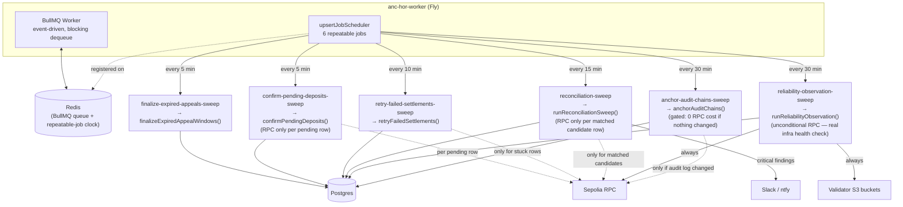
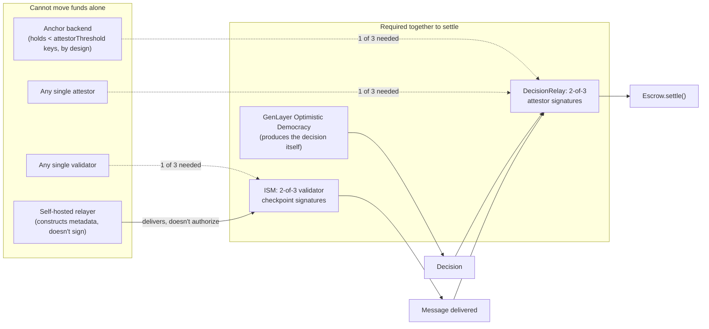
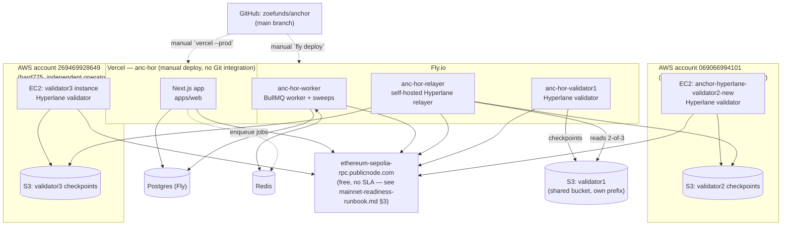

# Anchor

Adjudication-as-a-Service. Anchor decides what should happen when two parties
disagree about whether an obligation was fulfilled — starting with disputes
between AI agents transacting for data/API services, and now extending into
real cross-chain settlement of that decision.

Anchor answers one question, given evidence and an agreed policy: **what
outcome should occur?** GenLayer's Intelligent Contracts + Optimistic
Democracy provide the consensus-backed judgment primitive. Everything else —
case orchestration, evidence handling, policy versioning, the API, the
dashboard, and (as of this phase) the actual cross-chain settlement
infrastructure that carries a decision to funds on Sepolia and Solana — is
Anchor's own.

This README is the map. It is intentionally long and tries not to leave
anything out — deeper detail on any one piece lives in the linked docs.

---

## Table of contents

1. [What Anchor does, end to end](#what-anchor-does-end-to-end)
2. [Repo layout](#repo-layout)
3. [Trust boundary](#trust-boundary)
4. [Architecture: the full decision-to-settlement pipeline](#architecture-the-full-decision-to-settlement-pipeline)
5. [Security model](#security-model)
6. [Live deployment — every address, every app](#live-deployment--every-address-every-app)
7. [Local development](#local-development)
8. [Environment variables](#environment-variables)
9. [Testing](#testing)
10. [Deployment](#deployment)
11. [Known gaps and honest limitations](#known-gaps-and-honest-limitations)
12. [Further reading](#further-reading)

---

## What Anchor does, end to end

**MVP vertical**: agent-to-agent data/API task disputes.

1. Agent A pays Agent B to perform a data task (fetch/aggregate/process data
   against a stated spec).
2. Agent B delivers.
3. Agent A disputes that the delivery met spec.
4. Anchor collects the task spec, the delivery, and both agents' statements
   into an evidence bundle (with PII redaction — see
   `apps/web/src/lib/pii-redaction.ts`), submits it to a GenLayer Intelligent
   Contract under a versioned policy (`docs/policy-v1.md`), and gets back a
   structured, appealable decision (`docs/decision-schema.md`).
5. If nobody appeals within the appeal window (48h), or once an appeal
   resolves, the decision is **finalized**.
6. A finalized decision with a settlement target configured is **relayed
   cross-chain** via Hyperlane to either a Sepolia `DecisionRelay` contract
   or a Solana `decision-relay` program, which — once independently
   attested by a real M-of-N set of attestor keys — actually moves funds in
   an escrow.

Steps 1-5 are the original MVP. Step 6 (real cross-chain settlement with a
genuine, independently-verifiable trust model) is what the most recent
phase of work built and hardened.

---

## Repo layout

The worker process (`apps/web/src/worker.ts`) is the one piece of this
layout worth a diagram of its own — one BullMQ `Worker` plus 6 scheduled
sweeps, each cheap when idle:



```
apps/web/                     Next.js app — API routes, case/evidence UI,
                               Postgres via Prisma, BullMQ job queue, and
                               the settlement-dispatch logic (lib/hyperlane.ts,
                               lib/solana-settle.ts, lib/adjudication-service.ts)

genlayer/contracts/           Python Intelligent Contracts (GenVM) — adjudicator.py
genlayer/deploy/              TS deploy scripts for GenLayer Studio
genlayer/tests/               Direct-mode + integration contract tests

packages/types/                Shared TypeScript types (Case, Evidence, Policy, Decision)
packages/genlayer-sdk/         Thin wrapper around GenLayer's JS SDK
packages/mcp-server/           MCP server exposing Anchor's API as tools for any MCP agent
packages/hyperlane-relay/      Shared EVM DecisionRelay dispatch/encoding logic
                                (used by apps/web/src/lib/hyperlane.ts)

chains/evm/                    DecisionRelay.sol, TrustedRelayerIsm.sol,
                                AuditAnchor.sol, SolanaCaseReceiver.sol —
                                Foundry project, Sepolia
chains/solana/                 escrow + decision-relay native Solana programs
                                — Testnet
chains/hyperlane-relayer/       Self-hosted Hyperlane relayer (Fly app
                                anc-hor-relayer) — delivers messages the
                                public relayer network won't touch
chains/hyperlane-validator/     Self-hosted Hyperlane validators (Fly apps
                                anc-hor-validator1/2) — sign checkpoints,
                                back the real multisig ISM

docs/                          Policy specs, decision schema, architecture
                                notes, and the two deep-dive security docs:
                                multisig-attestor-setup.md,
                                self-hosted-validator-setup.md
```

---

## Trust boundary

No single actor — Anchor's own backend included — can unilaterally move
funds:



```
YOUR INFRASTRUCTURE (apps/web, packages/*)
  Case lifecycle, evidence storage/hashing, policy versioning,
  privacy (party pseudonymization + PII redaction), API, dashboard,
  settlement dispatch (computes attestation hashes, collects signatures,
  submits cross-chain transactions)

GENLAYER (genlayer/*)
  Intelligent Contract execution, AI validator evaluation,
  Optimistic Democracy consensus, appeals, finality

HYPERLANE (chains/hyperlane-relayer/, chains/hyperlane-validator/)
  Cross-chain message transport (Sepolia <-> Solana Testnet) —
  self-hosted relayer + self-hosted validators, no public/paid vendor

DESTINATION CHAINS (chains/evm/, chains/solana/)
  DecisionRelay.sol / decision-relay program — the actual funds-moving
  contracts, gated by a real M-of-N attestor signature requirement
  independent of who dispatched the Hyperlane message

EXTERNAL (not in MVP)
  A production payment processor's own escrow/settlement rails, if
  Anchor is ever integrated as a decision layer on top of one
```

---

## Architecture: the full decision-to-settlement pipeline

See [`docs/architecture.md`](docs/architecture.md) for the full diagram
set (system components, this pipeline as a sequence diagram, the
validator/ISM checkpoint flow, and the current trust-layer independence
map) — kept in sync with this section and with
[`docs/mainnet-readiness-runbook.md`](docs/mainnet-readiness-runbook.md).

```
1. Case created (API or dashboard) → evidence submitted → policy selected
2. runAdjudicationJob() (apps/web/src/lib/adjudication-service.ts):
     - builds evidence_json, calls GenLayer's adjudicate() via
       genlayer/contracts/adjudicator.py
     - GenLayer's Optimistic Democracy consensus returns outcome +
       claimant/respondent share bps + reason codes
     - computeDecisionHash(): sha256 of case/policy ids, outcome, shares,
       reason codes, evidenceHash, contractCodeHash — this is what's
       actually carried on-chain as proofHash later, so a destination
       chain can verify the settled outcome against what Anchor claims
       to have decided, not just that evidence existed
3. Case enters APPEAL_WINDOW (48h). Either:
     a. Nobody appeals → finalizeExpiredAppealWindows() (periodic sweep,
        every 5 min) finalizes it, or
     b. Someone appeals → a fresh adjudication round runs, decision may
        change, THEN finalizes
4. dispatchSettlementForDecision() (apps/web/src/lib/adjudication-service.ts):
     - EVM (sepolia): dispatchDecisionForCase() in lib/hyperlane.ts
         - computes the attestation hash (decision content + origin +
           recipient contract address, binding it to exactly this
           decision and this deployed contract)
         - signs with whatever ATTESTOR_PRIVATE_KEYS the backend holds
         - if that's fewer than attestorThreshold, throws
           InsufficientAttestorSignaturesError — as of 2026-09-07 two
           other automated signers (`anc-hor-attestor2`/`anc-hor-attestor3`)
           normally close that gap on their own within their polling
           interval, so most decisions never actually wait on a human;
           see "Co-signing" below for the exception path — otherwise
           dispatches immediately via Hyperlane's Mailbox
     - Solana (solanatestnet): submitAttestedSettle() in
       lib/solana-settle.ts
         - same pattern: computes the attestation message, signs with
           the backend's one Solana attestor key, needs enough of the
           other two automated signers' signatures to reach the real
           2-of-3 threshold (same `anc-hor-attestor2`/`anc-hor-attestor3`
           processes also run the Solana auto-signer)
         - builds a versioned Solana transaction (Address Lookup
           Table–based, since 2+ Ed25519 verify instructions exceed
           Solana's 1232-byte legacy transaction limit) containing the
           Ed25519 verify instructions + the AttestedSettle instruction,
           and submits it DIRECTLY (not via Hyperlane) — see
           docs/multisig-attestor-setup.md's Solana section for why
5. Hyperlane's Mailbox (Sepolia) or the direct Solana transaction carries
   the decision to the destination
6. Destination-side verification:
     - EVM: DecisionRelay.sol's handle() — requires the message came
       via the Mailbox from a trusted sender AND passed the real
       multisig ISM (2-of-3 validator checkpoints) AND carries
       attestorThreshold-many valid attestor signatures over its own
       content
     - Solana: decision-relay's attested_settle() — requires
       attestorThreshold-many real, non-redirected Ed25519 signatures
       from registered attestor keys, verified via Solana instruction
       introspection
7. Only once both checks pass does the destination contract/program
   actually move funds (CPI into escrow's settle() on Solana; a
   configurable settlement target's settle() call on EVM)
```

### Co-signing when the backend can't reach threshold alone

Both chains are configured so the backend deliberately holds **fewer**
than `attestorThreshold` keys — real M-of-N, not "one operator holding
enough keys to look like M-of-N." As of 2026-09-07, both chains are
2-of-3 with the other two keys held by automated Fly signers
(`anc-hor-attestor2`/`anc-hor-attestor3`), each running its own policy
gate that only co-signs decisions under `AUTO_ATTESTOR_MAX_AMOUNT_USD` —
so in the normal case, no human is involved at all. The manual flow
below is now the exception path: it still exists and still works, for
decisions above that cap or if an automated signer is unavailable.

- **EVM**: `Decision.pendingAttestationHash`/`pendingAttestationSignatures`
  persist the wait. An external attestor holder fetches the pending hash
  via `GET /api/internal/pending-attestations` (bearer-secret gated via
  `ATTESTOR_COSIGN_SECRET`), signs it **offline**
  (`cast wallet sign --private-key <key> --no-hash <hash>`), and submits
  only the resulting signature via
  `POST /api/internal/pending-attestations/[decisionId]/sign` — the
  route verifies the signature actually recovers to a registered
  attestor address before accepting it. Completion happens within ~10
  minutes via the worker's periodic retry sweep.
- **Solana**: the same pattern exists via
  `GET /api/internal/pending-solana-attestations` and
  `POST .../pending-solana-attestations/[decisionId]/sign` — this used
  to be a manual-only gap (no queue at all), but that gap has since been
  closed with a real API mirroring the EVM one; see
  `docs/multisig-attestor-setup.md`'s "Co-signing a real decision
  (Solana side)" for the exact flow.

Note: independence between `anc-hor-attestor2`/`anc-hor-attestor3` and
the backend worker is **not real** — they share the same Fly
account/org with raw keys in Fly secrets, not separate cloud accounts
or KMS/HSM custody. Automating away the human-in-the-loop step improved
availability, not custody independence — see
`docs/mainnet-readiness-runbook.md`.

---

## Security model

This is the section that changed the most in the most recent phase of
work. Full technical detail and the exact live addresses live in
`docs/multisig-attestor-setup.md` and `docs/self-hosted-validator-setup.md`
— what follows is the complete summary.

### 1. Decision-content attestation (M-of-N, both chains)

Neither `DecisionRelay.sol` nor Solana's `decision-relay` trusts "a
message arrived via Hyperlane" as sufficient to move funds. Both require
a threshold-many (currently 2-of-3 on both chains) set of independently
held ECDSA (EVM) / Ed25519 (Solana) signatures over the decision's own
content — case id, outcome, shares, escrow id, proof hash, origin
domain, and (on EVM) the specific deployed contract's own address /
(on Solana) the specific deployed program's own address + cluster
genesis hash, so a signature can never be replayed against a different
deployment or a different chain.

The backend holds **one** key per chain; the other two are held by the
automated `anc-hor-attestor2`/`anc-hor-attestor3` signers (as of
2026-09-07 — previously the second key was generated and held entirely
offline by a human operator; see `docs/multisig-attestor-setup.md` for
that retired design). The backend structurally cannot forge a
settlement alone — reaching threshold always needs at least one of the
other two signers.

### 2. Governance separation (EVM only, so far)

`DecisionRelay.sol`'s `owner` — who can add/remove attestors or lower
the threshold — is a real 2-of-2 Gnosis Safe (canonical v1.4.1,
deployed via the real `SafeProxyFactory` on Sepolia), not a wallet.
Every governance change requires two independently collected
signatures and is logged via a dedicated event
(`AttestorAdded`/`AttestorRemoved`/`AttestorThresholdChanged`/
`TrustedSenderChanged`/`SettlementTargetChanged`). This closes a real
gap a security re-audit found: an owner that's the same key as an
attestor (or the backend) could rewrite the very policy the attestors
are supposed to enforce, without ever forging a signature.

### 3. Cross-instruction redirection defense (Solana)

Solana's Ed25519 native-program verification lets an instruction's
`signature_instruction_index`/`public_key_instruction_index`/
`message_instruction_index` fields point at *different* instructions in
the same transaction. A naive parser reading pubkey/message bytes from
the current instruction's own data — without checking those indices are
all `u16::MAX` (meaning "this instruction, no redirection") — is
forgeable: an attacker can reference a genuinely-signed but unrelated
instruction for the real cryptographic check while placing forged
attestor-pubkey/message bytes at readable offsets in the current
instruction. `decision-relay`'s `parse_valid_ed25519_attestation`
requires all three indices equal `u16::MAX`. This was a real P0
vulnerability caught by a re-audit before production use, verified with
an adversarial regression test (reverting the fix and confirming the
test genuinely fails, then restoring it and confirming it passes).

### 4. Transport-layer origin verification (EVM: real; Solana: not yet)

- **Sepolia**: `DecisionRelay.sol`'s `customIsm` is now a real
  `StaticMerkleRootMultisigIsm` (deployed via Hyperlane's own canonical
  factory), requiring checkpoints signed by 2 independently-run
  Hyperlane validators before a message is accepted — replacing
  `TrustedRelayerIsm.sol`'s always-true `verify()`.
- **Solana**: `decision-relay`'s `TRUSTED_ISM` is still a
  `TrustedRelayer`-only composite ISM node — always accepts. Narrower
  exposure than the EVM side had before its fix, since Solana's
  `attested_settle` already independently gates real fund movement via
  #1 above; a forged/spam inbound message can still reach the
  notification-only `handle()`, just can't move funds through it.

### 5. External audit-chain anchoring

Every mutating API route writes its audit-log row inside the same
Prisma transaction as the mutation itself (universal atomicity — no
route can silently skip its own audit trail). Each row is hash-chained
(`prevHash`/`hash`) so an in-place edit to one historical row is
detectable. A periodic sweep (every 30 min) posts each organization's
current chain-head hash to a small `AuditAnchor.sol` contract on
Sepolia, signed by a key dedicated to this one purpose
(`AUDIT_ANCHOR_PRIVATE_KEY`, distinct from the dispatch/attestor keys) —
so rewriting the database's entire audit history undetectably now also
requires rewriting a public chain's own history, which it doesn't
allow. Explicitly documented scope: this does **not** defend against a
fully malicious operator who controls both the database and this
anchoring key (still the same operator today) — it defends against
accidental corruption, a partial compromise that doesn't also get this
specific key, and gives any external auditor a genuinely
independent, publicly-checkable timestamped record.

### 6. What's deliberately NOT solved here

See "Known gaps and honest limitations" below — this section only
covers what's actually built.

---

## Live deployment — every address, every app



### Fly.io apps

| App | Purpose |
|---|---|
| `anc-hor-worker` | Long-lived BullMQ Worker — adjudication jobs, settlement dispatch, audit-anchor sweep |
| `anc-hor-relayer` | Self-hosted Hyperlane relayer (Sepolia <-> Solana Testnet message delivery) |
| `anc-hor-validator1` | Hyperlane validator #1 — signs Sepolia checkpoints |
| `anc-hor-validator2` | Hyperlane validator #2 — signs Sepolia checkpoints |
| `anc-hor-db` | Unmanaged Fly Postgres (public IP + TCP passthrough — see `DEPLOYMENT.md`) |

### Vercel

- Production: **https://anc-hor.vercel.app** (Next.js app, API routes, dashboard)

### Sepolia (chain id 11155111)

| Contract | Address | Purpose |
|---|---|---|
| `DecisionRelay` (current) | `0x1fc130416Dc09dff60e0Ea3C8dE8474e8428b3E2` | Receives decisions, gates settlement on M-of-N attestation + multisig ISM |
| Multisig ISM (`StaticMerkleRootMultisigIsm`) | `0xd916b90858B8bF7Cc7E111D3C7923ab4Fe0FCcf0` | Real 2-of-3 validator-checkpoint verification |
| Escrow (V2) | `0x4C7765A6823dc27Eca1DE174FceeAE5048d403e7` | Holds/releases case funds per adjudicated shares |
| `AuditAnchor` | `0x642C8f4De6302D06fC0620efE571dFd69DF94CEA` | External audit-chain checkpointing (not independently re-verified live this pass — see `AUDIT_ANCHOR_CONTRACT_ADDRESS` in `apps/web/.env.example`) |
| Governance Safe | `0xc200534F7Debf2816C085c5a156AbD686FA19f4C` | 2-of-2 owner of `DecisionRelay` |
| Hyperlane Mailbox | `0x345E7246631ceb0300427caB75eacA10c326BB09` | Anchor's own (migrated off the canonical shared Sepolia Mailbox on 2026-09-07 after finding its hooks disconnected — see `docs/mainnet-readiness-runbook.md`) |
| Hyperlane MerkleTreeHook | `0xA32341dc796DB6C51c0D1695751aC9AA2Dd77aBB` | Anchor's own |
| Hyperlane ValidatorAnnounce | `0x198A6ec048C665d7E4dc2b40Cb2c715Db1cEC6F5` | Anchor's own |

See `apps/web/deployment-manifest.json` (regenerated live by
`scripts/generate-deployment-manifest.ts`) and
`docs/mainnet-readiness-runbook.md`'s "Exact current addresses" table
for the live-verified source of truth — this table is a snapshot and
can drift.

**Attestor addresses (EVM, 2-of-3, fully automated as of 2026-09-07)**:
`0x3261CEF8Ca14FCc9EF1Cd584209D7c3b7f578b70` (backend-held,
`anc-hor-worker`), `0xfFC936AEab8220bFD283f3016356F67EEb32130B`
(`anc-hor-attestor2`), `0x6F1A0EE85f08C54669E33103486D98D947Efc043`
(`anc-hor-attestor3`) — no human co-signs a decision under the
auto-attestor's dollar cap anymore; see `docs/multisig-attestor-setup.md`
for the retired offline-key design this replaced, and
`docs/mainnet-readiness-runbook.md` for why operator independence
across these three signers is still not real (same Fly account/org as
the backend worker, raw keys in Fly secrets rather than KMS/HSM).

**Governance Safe owners (2-of-2)**: `0x7401c129EDfc26E68FE19309fE461eb3Db1058Eb`
(deployer/dispatch key) and `0xEDc300fb7Bd8437C90aF68393381514722FE128c`
(governance key) — distinct from every attestor key above, on purpose.
Operator independence between these two owners is unverified.

**Validator addresses (2-of-3)**: `0x2ffFd80d446835214EF87Eb3753B48935550f73f`
(validator1, Fly), `0xf171c23607b892797Eb5eb4e52fc668f924Df0A3`
(validator2, AWS), `0x4dbc8704ebD282535d64Be6daDF2a477C543114D`
(validator3, AWS, different account than validator2).

### Solana Testnet

| Program/account | Address | Purpose |
|---|---|---|
| `decision-relay` program | `DGWSTw1PLsRbndb8spVkrtu3hfH599tRRBJ1JhVBbpVN` | Notification handling + AttestedSettle |
| `escrow` program | `825aV7GJ31cjeTDycH1woKiaC95soJUYkKvZNFMugeZn` | Actual case/fund escrow, settled via CPI |
| Hyperlane Mailbox | `75HBBLae3ddeneJVrZeyrDfv6vb7SMC3aCpBucSXS5aR` | Canonical Hyperlane infra |
| Hyperlane ValidatorAnnounce | `8qNYSi9EP1xSnRjtMpyof88A26GBbdcrsa61uSaHiwx3` | Canonical Hyperlane infra |
| Address Lookup Table | `DRSsBj3qsZ3YG2EmAivLPp4vjtJu54FmeZRaWqobeFEs` | Keeps AttestedSettle transactions under the 1232-byte limit |

**Attestor addresses (Solana, 2-of-3, fully automated as of 2026-09-07)**:
`4EnM9nxVcWoaRRsEZnq2otdVrQLiwdBsBkqxdmRoVBCq` (backend, `anc-hor-worker`),
`4eCqu5xB2EoLFw5AfSyjTm3cRnjdocs6wfwGaSp7rigZ` (`anc-hor-attestor2`),
`9uKHpvMk9tijzwXFicojZ5z4RnNdcLfqaDxDfjNGGMn1` (`anc-hor-attestor3`) —
see docs/multisig-attestor-setup.md for why the old offline-held key
was retired.

### Checkpoint storage

Real AWS S3 — bucket `anchor-hyperlane-validator-checkpoints`, region
`eu-north-1`. (Cloudflare R2 was tried first and abandoned after a real,
reproduced upstream compatibility bug in Hyperlane's validator binary —
see `docs/self-hosted-validator-setup.md`'s "Why AWS S3, not R2"
section.)

---

## Local development

Prerequisites: Node 20+, Docker (for local Postgres + Redis), a GenLayer
Studio account/wallet, Foundry (`forge`/`cast`) for EVM work, the Solana
CLI + `cargo build-sbf` for Solana work.

```bash
cd apps/web
cp .env.example .env       # fill in DATABASE_URL, REDIS_URL, GENLAYER_* vars
                            # — see "Environment variables" below for the
                            # full list, including what's only needed for
                            # real cross-chain settlement
docker compose up -d       # starts local Postgres and Redis
npm install
npx prisma migrate dev
npm run dev
```

The adjudication job queue (BullMQ, backed by Redis) runs an in-process
worker inside `npm run dev`/`next start` by default. For a standalone
worker process (serverless web deployments, or scaling job throughput
independently), see `npm run worker` in `apps/web` and
`src/lib/queue.ts`'s header comment.

GenLayer contract development happens under `genlayer/`. EVM contract
development happens under `chains/evm/` (`forge build`/`forge test`).
Solana program development happens under `chains/solana/`
(`cargo build-sbf`, `cargo test -p decision-relay`).

---

## Environment variables

The authoritative, fully-commented list is `apps/web/.env.example` —
every variable there has a comment explaining exactly what it's for,
what format it expects, and what breaks if it's missing or wrong. This
is a summary grouped by concern:

**Core app**: `APP_ENV`, `DATABASE_URL`, `REDIS_URL`, `SESSION_SECRET`,
`APP_ORIGIN`

**Email (Brevo)**: `BREVO_API_KEY`, `BREVO_MCP_API_KEY`, `EMAIL_FROM_ADDRESS`

**File evidence (Cloudinary)**: `CLOUDINARY_CLOUD_NAME`,
`CLOUDINARY_API_KEY`, `CLOUDINARY_API_SECRET`

**GenLayer**: `GENLAYER_NETWORK` (defaults to `studioDevnet` — Studio Next
/ Studio-dev, chain 61997; set to `studionet` for the old 61999 network),
`GENLAYER_PRIVATE_KEY`

**Hyperlane dispatch (EVM)**: `HYPERLANE_RELAY_PRIVATE_KEY`,
`HYPERLANE_RELAY_RPC_URL`

**EVM attestor multisig**: `ATTESTOR_PRIVATE_KEYS` (comma-separated;
old singular `ATTESTOR_PRIVATE_KEY` still read as a fallback),
`ATTESTOR_COSIGN_SECRET`

**Audit anchoring**: `AUDIT_ANCHOR_CONTRACT_ADDRESS`,
`AUDIT_ANCHOR_PRIVATE_KEY`

**Solana settlement**: `SOLANA_RPC_URL`, `SOLANA_ATTESTOR_PRIVATE_KEY`,
`SOLANA_RELAY_PRIVATE_KEY`, `SOLANA_DECISION_RELAY_LOOKUP_TABLE`

**Hyperlane validators** (Fly secrets, not web app env): `VALIDATOR_KEY`,
`AWS_ACCESS_KEY_ID`, `AWS_SECRET_ACCESS_KEY`, `S3_BUCKET`, `S3_REGION`,
`S3_FOLDER` — see `chains/hyperlane-validator/README.md`

**Hyperlane relayer** (Fly secrets, not web app env): see
`chains/hyperlane-relayer/README.md`

---

## Testing

```bash
# TypeScript typecheck (from repo root)
npx tsc --noEmit -p apps/web

# EVM contracts (from chains/evm/)
forge test

# Solana program (from chains/solana/)
cargo test -p decision-relay

# GenLayer contracts (from genlayer/)
pytest tests/direct                    # fast, in-memory
gltest tests/integration/ -v -s        # real GenLayer Studio/GLSim
```

Run all four before any commit that touches settlement/contract code —
that's the discipline this whole security-hardening phase was built
under.

---

## Deployment

See `DEPLOYMENT.md` for the full deployment layout (why Fly unmanaged
Postgres instead of Fly MPG, exact redeploy commands for every app,
where secrets live) and `chains/hyperlane-relayer/README.md` /
`chains/hyperlane-validator/README.md` for the relayer/validator-specific
deploy commands and known Fly quirks (e.g. apps with no `[http_service]`
don't auto-start after a config-only deploy — needs an explicit
`flyctl machine start`).

---

## Known gaps and honest limitations

Stated plainly, not swept under anything:

1. **Validator operator independence is real but only partial.** As of
   the 2026-09-06 validator2 replacement, all three Hyperlane validators
   run under distinct operators/accounts (validator1: Fly under
   `priscilla-george-personal`; validator2/validator3: separate AWS
   accounts). Cloud-provider independence is not achieved — validator2
   and validator3 are both AWS, just different accounts. See
   `docs/mainnet-readiness-runbook.md` §0 for the tracked, verified
   status.
2. **Solana-side transport ISM is real but unproven end-to-end.**
   `decision-relay` now returns `REAL_MULTISIG_ISM`, Anchor's own
   deployment of `hyperlane-sealevel-multisig-ism-message-id` with the
   same 2-of-3 validator set as EVM (the old always-accepting
   `TRUSTED_ISM` is kept only for rollback). This closes the "permissive
   ISM" gap, but it has not yet had `ISM_MIGRATION.md`'s 8-point testnet
   proof run against it — do not call it "secure" or "independent" until
   that's done. Regardless, this is a transport-layer gap only: real
   fund movement is independently gated by Solana-side M-of-N
   attestation (`attested_settle`), which a compromised or bypassed ISM
   cannot itself authorize.
3. **EVM and Solana attestor sets are 2-of-3 but not operator-independent.**
   As of 2026-09-07, both chains moved from "backend + one offline human
   key" to a fully automated 2-of-3 set (`anc-hor-attestor2`/`anc-hor-attestor3`,
   each gated by a dollar cap in `apps/web/src/lib/auto-attestor/policy.ts`).
   This closes the old "no automated Solana co-signing queue" gap and
   removes the human-in-the-loop bottleneck on both chains, but it is
   **not** genuine custody independence: the two new signers run on the
   same Fly account/org as the backend worker, with raw keys in Fly
   secrets rather than KMS/HSM-held keys in separate cloud accounts. A
   compromise of that Fly account or its secrets store could plausibly
   reach all three EVM keys or all three Solana keys. See
   `docs/mainnet-readiness-runbook.md` and `docs/multisig-attestor-setup.md`.
4. **`AUDIT_ANCHOR_PRIVATE_KEY` is backend-held**, not split like the
   attestor keys — a compromise of the backend can still tamper with
   future anchors (though not past ones, since those are already on an
   immutable public chain).
5. **AWS IAM policy for the validator S3 bucket is `AmazonS3FullAccess`**,
   not scoped down to just that one bucket (not re-verified this pass —
   see `docs/self-hosted-validator-setup.md`).
6. **Evidence provenance, KYC/consent workflows, chargeback-network
   compatibility** are explicitly out of scope — real regulatory/business
   work, not something to fake or half-build.
7. **Governance Safe (2-of-2) and attestor-signer operator independence
   are both explicitly tracked as unverified**, not assumed — see
   `docs/mainnet-readiness-runbook.md`'s trust-layer independence
   diagram, which is the authoritative, continuously-updated version of
   this list's custody-related items.
8. **No PDF/downloadable receipt rendering** and **no Python SDK** — the
   receipts/analytics work in this repo covers structured JSON receipts
   and the TypeScript SDK (`packages/anchor-sdk`) only.
9. **No true low-confidence-triggered human escalation.** GenLayer's
   Optimistic Democracy consensus doesn't expose a confidence score —
   escalation to a human reviewer is triggered by policy rules (amount
   thresholds, disagreement among validators, appeal filed), not by the
   adjudicator itself reporting low confidence.

---

## Further reading

- `docs/decision-schema.md` — the case/evidence/decision data contracts
- `docs/policy-v1.md` — the current adjudication policy
- `docs/hyperlane-integration.md` — original Hyperlane integration design notes
- `docs/multisig-attestor-setup.md` — the complete M-of-N attestor +
  governance Safe story: what's live, why, the day-2 runbook for
  co-signing and rotating keys
- `docs/self-hosted-validator-setup.md` — the complete validator +
  multisig ISM story: what's live, the R2-vs-S3 bug, the day-2 runbook
  for adding another validator
- `chains/evm/README.md`, `chains/solana/README.md` — contract/program-level notes
- `chains/hyperlane-relayer/README.md` — the relayer's own history,
  every bug found and fixed along the way, exact deploy commands
- `chains/hyperlane-validator/README.md` — the validators' own deploy
  runbook
- `DEPLOYMENT.md` — full infra layout and redeploy commands
