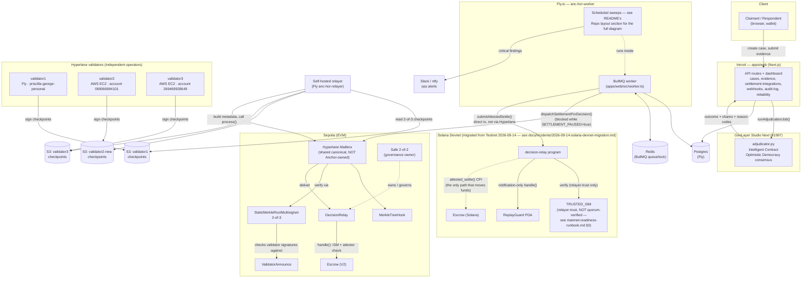
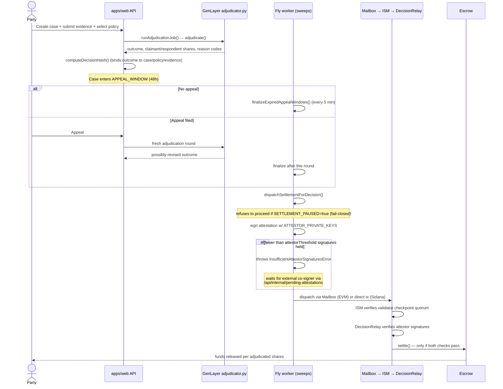

# Architecture diagrams

This is the visual companion to the README's [Architecture: the full
decision-to-settlement pipeline](../README.md#architecture-the-full-decision-to-settlement-pipeline)
section. It holds the two truly whole-system diagrams (below). Every
other diagram lives directly in the doc it's actually about — each doc
owns its own diagram rather than everything being centralized here:

| Diagram | Lives in |
|---|---|
| Worker sweep architecture | [`README.md`](../README.md#repo-layout) (Repo layout) |
| Deployment topology (who runs what, where) | [`README.md`](../README.md#live-deployment--every-address-every-app) (Live deployment) |
| Trust boundary | [`README.md`](../README.md#trust-boundary) (Trust boundary) |
| Validator checkpoint → ISM → delivery flow | [`docs/hyperlane-integration.md`](hyperlane-integration.md) |
| Trust-layer independence map | [`docs/mainnet-readiness-runbook.md`](mainnet-readiness-runbook.md) §0 |
| Attestor co-signing (EVM) | [`docs/multisig-attestor-setup.md`](multisig-attestor-setup.md) |
| Alert escalation path | [`docs/ops-alert-escalation.md`](ops-alert-escalation.md) |
| Key rotation procedure | [`docs/key-rotation-checklist.md`](key-rotation-checklist.md) |
| V1 → V2 Escrow cutover (historical) | [`docs/v1-v2-escrow-cutover.md`](v1-v2-escrow-cutover.md) |

If a diagram and its doc's prose ever disagree, the prose and the live
on-chain/config state win — open an issue, don't just trust the picture.
All diagrams are Mermaid, rendered natively by GitHub — no image files
to keep in sync separately.

---

## 1. System components

What runs where, end to end. Boxes are real deployed services; arrows
are real traffic, not conceptual data flow.

---

## 2. Case lifecycle: adjudication to settlement

Mirrors the README pipeline text as a real sequence diagram.

---

## Keeping these current

Every diagram in this project references specific addresses, accounts,
or code paths. When any of the following changes, update the matching
diagram **in the same commit**, the same discipline this project applies
to `deployment.json` and `reliability-monitor.ts`'s `VALIDATORS`
constant:

- A validator is added, replaced, or moved to a different account/provider → this doc's §1, README's Live deployment + Trust boundary diagrams, `hyperlane-integration.md`, `mainnet-readiness-runbook.md`.
- The Safe owners, attestor set, or their independence status changes → `mainnet-readiness-runbook.md`'s independence map, README's Trust boundary diagram.
- `DecisionRelay`/`Escrow`/ISM is redeployed → this doc's §1, README's Live deployment diagram.
- The RPC provider changes (e.g. once a dedicated provider replaces the public endpoint from `mainnet-readiness-runbook.md` §3) → this doc's §1, README's Live deployment diagram, `mainnet-readiness-runbook.md`'s independence map.
- The settlement dispatch flow itself changes (new chain, new attestation scheme) → this doc's §2, `multisig-attestor-setup.md`.
- A worker sweep is added, removed, or its interval changes → README's Repo layout diagram.
- An alert severity or escalation rule changes → `ops-alert-escalation.md`.
- The escrow cutover/migration story changes → `v1-v2-escrow-cutover.md`.
