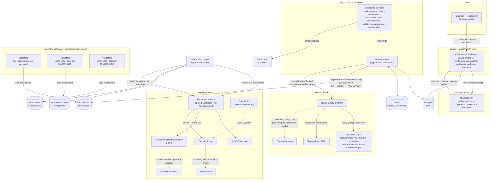
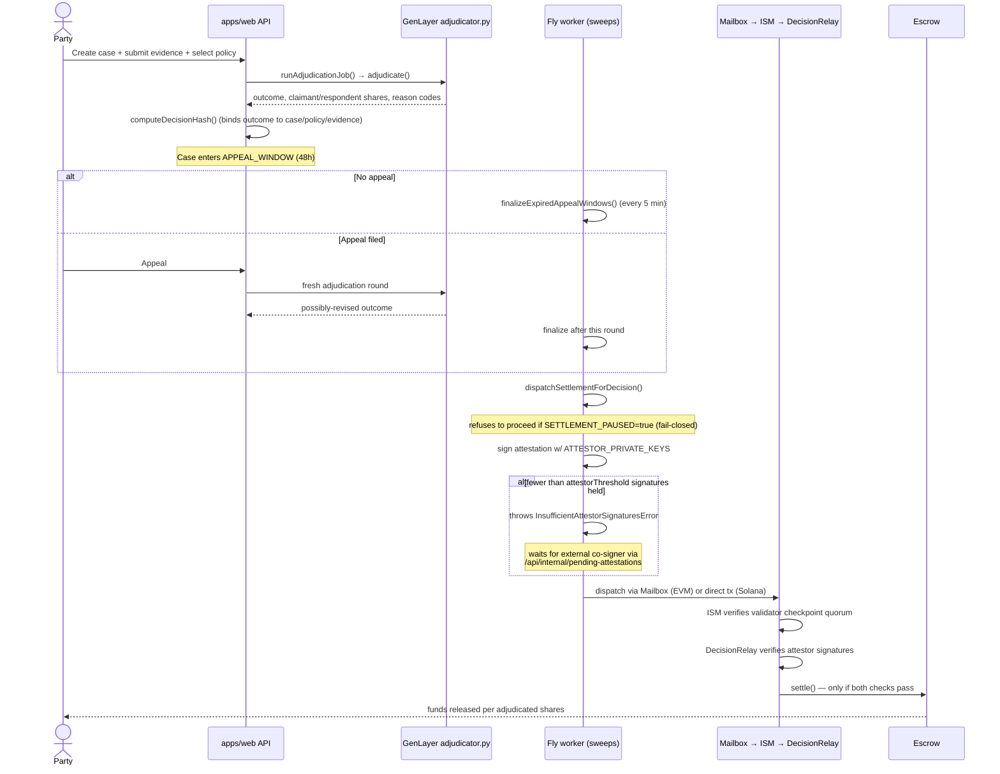
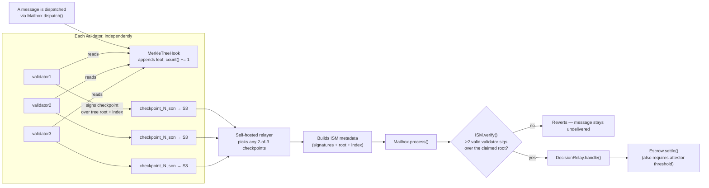
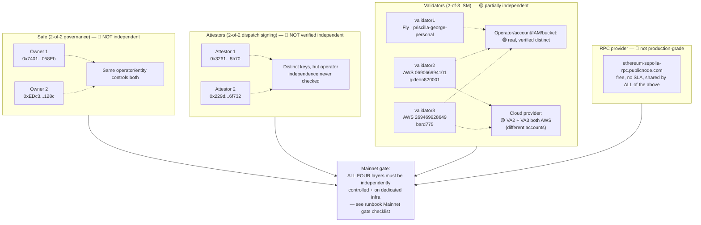

# Architecture diagrams

This is the visual companion to the README's [Architecture: the full
decision-to-settlement pipeline](../README.md#architecture-the-full-decision-to-settlement-pipeline)
section — that section is the authoritative prose description; the
diagrams here are kept in sync with it and with
[`docs/mainnet-readiness-runbook.md`](mainnet-readiness-runbook.md)'s
live baseline. If a diagram and the prose ever disagree, the prose in
the linked doc and the live on-chain/config state win — open an issue,
don't just trust the picture.

All diagrams are Mermaid, rendered natively by GitHub and by Claude
artifacts — no image files to keep in sync separately.

---

## 1. System components

What runs where, end to end. Boxes are real deployed services; arrows
are real traffic, not conceptual data flow.

---

## 2. Case lifecycle: adjudication to settlement

Mirrors the README pipeline text as a real sequence diagram.

---

## 3. Validator checkpoint → message delivery (EVM side)

What actually has to be true before a message can settle — the flow the
`checkpoint-currency` and `decisionrelay:ism` checks in
`reliability-monitor.ts`/`verify-deployment.ts` exist to verify.

---

## 4. Trust-layer independence — current state

Companion diagram to
[`mainnet-readiness-runbook.md`](mainnet-readiness-runbook.md)'s §0/§2 —
this is what "independence" actually looks like today, layer by layer.
**Green = verified independent. Yellow = partially independent. Red =
known not independent.** Update this diagram whenever the underlying
runbook section changes — it should never silently go stale like
`reliability-monitor.ts`'s hardcoded validator list did.

---

## Keeping these current

Every diagram here references specific addresses, accounts, or code
paths. When any of the following changes, update the matching diagram
**in the same commit**, the same discipline this project applies to
`deployment.json` and `reliability-monitor.ts`'s `VALIDATORS` constant:

- A validator is added, replaced, or moved to a different account/provider → §1, §3, §4.
- The Safe owners, attestor set, or their independence status changes → §4.
- `DecisionRelay`/`Escrow`/ISM is redeployed → §1.
- The RPC provider changes (e.g. once a dedicated provider replaces the
  public endpoint from `mainnet-readiness-runbook.md` §3) → §1, §4.
- The settlement dispatch flow itself changes (new chain, new attestation
  scheme) → §2.
