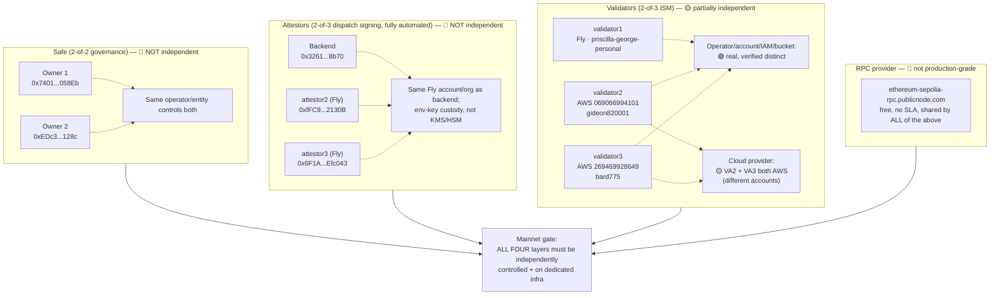

# Mainnet readiness runbook

**Status: tracking document. No mainnet deployment, no `SETTLEMENT_PAUSED`
lift, and no governance change (Safe, attestor, ISM, validator set) may be
made under this document's authority alone — each still requires its own
separate, explicit authorization at the time it's actually executed.**

This document exists to make "what's left before mainnet" a single
tracked artifact instead of something that only lives in chat history. It
was created in direct response to an external review, reproduced in full
context at the bottom of this file, with two corrections that apply
throughout:

1. **"Three validators" is not the same as "independent consensus."** The
   2026-09-06 validator2 replacement achieved real A/B/C operator/account
   independence for the *validator* layer only. The Safe (2-of-2) and the
   attestor set (M-of-N) are separate trust layers with the same
   independence requirement, currently unmet. A 2-of-3 ISM with an
   independent validator set does not, by itself, mean the system has
   independent multi-party control — it means one of three layers does.
2. **A free public RPC endpoint is a testnet convenience, not a
   production-reliability claim.** The 2026-09-06 migration off the
   exhausted Alchemy key onto `https://ethereum-sepolia-rpc.publicnode.com`
   was necessary (Anchor had zero paid RPC budget) but must not be counted
   as reliability *hardening* — it removed a hard dependency on a paid key
   we couldn't fund, it did not add an SLA, dedicated rate limit, or
   failover. Section 3 below tracks this honestly as an accepted risk with
   monitoring, not a completed item.

---

## 0. Baseline — corrected and verified, 2026-09-06

See [`docs/architecture.md`](architecture.md) for the full diagram set.
The trust-layer independence diagram from that doc is reproduced here
since it's this runbook's own subject — update both together:

### Environment label

**Everything below is Sepolia testnet.** No component described in this
document has ever handled real customer funds. "Live," "production," and
"deployed" describe real, running infrastructure and real on-chain state —
they do not mean "ready for real money." This label must not be dropped
in any customer-facing or investor-facing derivative of this document.

### Exact current addresses and hashes (Sepolia, verified live at commit `6c7065e`)

| Component | Address | Bytecode hash (`codehash`) |
|---|---|---|
| Mailbox (Anchor's own, deployed 2026-09-07) | `0x345E7246631ceb0300427caB75eacA10c326BB09` | not re-verified this pass |
| MerkleTreeHook (Anchor's own) | `0xA32341dc796DB6C51c0D1695751aC9AA2Dd77aBB` | not re-verified this pass |
| ValidatorAnnounce (Anchor's own) | `0x198A6ec048C665d7E4dc2b40Cb2c715Db1cEC6F5` | not re-verified this pass |
| NoopIsm (Mailbox's own default ISM at deploy time — not the ISM actually used, see `ISM` row) | `0x28bE617493Cd993D76Cd04b969694dCB64702951` | not re-verified this pass |
| ISM (`StaticMerkleRootMultisigIsm`, 2-of-3) | `0xd916b90858B8bF7Cc7E111D3C7923ab4Fe0FCcf0` | `0xe83f070584f3a57d54c9f89cca8b208733f03c19254479faafac844780a37df7` |
| DecisionRelay | `0x1fc130416Dc09dff60e0Ea3C8dE8474e8428b3E2` | `0x819bb5e028030cf7f77091aa66d12b55f3f73450d7819f47a47c2937f55c47e5` |
| Escrow (V2) | `0x4C7765A6823dc27Eca1DE174FceeAE5048d403e7` | `0x01d1050bfe1c2731c187938a75f384dbcd36dec9741b48d2ff34515344c4c1a3` |
| Safe (governance owner) | `0xc200534F7Debf2816C085c5a156AbD686FA19f4C` | nonce at time of writing: 16 |
| Dispatcher / trustedSender / depositAuthorizer | `0x7401c129EDfc26E68FE19309fE461eb3Db1058Eb` | — |

**2026-09-07: migrated off the canonical shared Hyperlane Sepolia
Mailbox** (`0xfFAEF09B3cd11D9b20d1a19bECca54EEC2884766`). Root cause: that
Mailbox's `defaultHook`/`requiredHook` were found disconnected from any
real `MerkleTreeHook` — dispatches through it never advanced a merkle
tree a validator could checkpoint against, so real multisig-ISM-based
delivery could never have worked through it regardless of validator
setup. This likely affects other Hyperlane integrators still pointed at
that same shared Mailbox, not just Anchor. Fixed by deploying Anchor's
own Mailbox + MerkleTreeHook + ValidatorAnnounce (`chains/evm/deploy/DeployOwnMailbox.s.sol`,
owner `0x7401c129EDfc26E68FE19309fE461eb3Db1058Eb`) and re-pointing
`packages/hyperlane-relay/index.ts`'s `HYPERLANE_MAILBOX.sepolia` and all
three validators' `config.json` at it. The `ISM` row above is unchanged
— it was never the broken component — but it now receives checkpoints
against the new Mailbox's merkle root, not the old one's.

**Validator set** (2-of-3, `chains/hyperlane-validator/deployment.json` is
the source of truth — this table is a snapshot, that file is authoritative):

| Label | Address | Operator | Account | Provider |
|---|---|---|---|---|
| validator1 | `0x2ffFd80d446835214EF87Eb3753B48935550f73f` | anchor-operator | `fly:priscilla-george-personal` | fly.io |
| validator2 | `0xf171c23607b892797Eb5eb4e52fc668f924Df0A3` | independent-operator-gideon820001 | `aws:069066994101` | aws-ec2 |
| validator3 | `0x4dbc8704ebD282535d64Be6daDF2a477C543114D` | independent-operator-bard775 | `aws:269469928649` | aws-ec2 |

Operator/account/IAM-principal/S3-bucket independence: **real**, verified
via `verify-deployment.ts`'s `independence` check (14 pass / 6 warn / 0
fail as of the last full run). Cloud-provider independence: **not
achieved** — validator2 and validator3 are both AWS (different accounts).
See §2.3.

**2026-09-07: moved to a fully automated 2-of-3 attestor set**, retiring
the manually-held offline attestor key entirely — settlement no longer
requires any human to co-sign. Executed via Safe tx
`0x6c10196d3c061b05e5185f6bdf11520670da8944f2caaeb5675636cacd9957fd`
(`removeAttestor(0x229d46B4...)`, `addAttestor(0xfFC936AE...)`,
`addAttestor(0x6F1A0EE8...)`), verified live against
`deployment-manifest.json`.

**Attestor set** (2-of-3, `DecisionRelay.isAttestor`):
- `0x3261CEF8Ca14FCc9EF1Cd584209D7c3b7f578b70` — the existing backend
  automated key (`ATTESTOR_PRIVATE_KEYS` on `anc-hor-worker`).
- `0xfFC936AEab8220bFD283f3016356F67EEb32130B` — new automated signer,
  `anc-hor-attestor2` (Fly app, raw key in its own isolated Fly secrets
  store — env-key custody, not KMS/HSM; see `apps/web/scripts/auto-attestor-sign.ts`).
- `0x6F1A0EE85f08C54669E33103486D98D947Efc043` — new automated signer,
  `anc-hor-attestor3` (Fly app, same custody model as attestor2).

Each of the two new signers runs its own policy gate
(`apps/web/src/lib/auto-attestor/policy.ts`) before signing: it will
only co-sign a pending decision if the case amount is under
`AUTO_ATTESTOR_MAX_AMOUNT_USD` (currently $500). Anything above that
cap is not auto-signed by either — same as before, it waits for manual
attestor action. All other gates (KYC, deposit/target binding) were
already enforced upstream in `dispatchDecisionForCase` before a
decision ever reaches "pending attestation" state, so this cap is the
one genuinely new check.

**Operator independence: not real** — despite being three separate
signing keys, `anc-hor-attestor2` and `anc-hor-attestor3` both run on
the same Fly account/org as the backend worker, with raw private keys
in Fly secrets rather than KMS/HSM-held keys. A compromise of that Fly
account or its secrets store could plausibly reach all three. This is
a real, deliberate tradeoff to unblock self-service settlement quickly
without new cloud accounts/billing — **do not describe this as
"independent" or "secure 2-of-3" in any customer-facing material**.
Upgrading to genuinely separate custody (different cloud accounts,
KMS/HSM-held keys) remains open work — see §2.2.

**Safe owners** (2-of-2): `0x7401c129EDfc26E68FE19309fE461eb3Db1058Eb`,
`0xEDc300fb7Bd8437C90aF68393381514722FE128c`. Operator independence:
**not verified, likely not real** — tracked in §2.1.

**RPC hosts currently in use** (as of 2026-09-06, post-migration):
`https://ethereum-sepolia-rpc.publicnode.com` — used by Vercel production,
the Fly worker, Fly validator1, the Fly relayer, and both AWS-hosted
validators (validator2, validator3). See §3 for why this is a tracked
risk, not a resolved item.

**Deployment revision**: git commit `6c7065ecd9c542117335c9112821efc8d5dce513`
on `main`, GitHub `zoefunds/anchor`.

### Solana inbound transport — updated 2026-09-07, real multisig ISM now live

**Superseded since 2026-09-06/07**: this section previously described
`TRUSTED_ISM` (`PNMVXEfSvLYhF917ViQTSTf4MVmVjXs7zrVBNe2mfus`, a
`hyperlane-sealevel-composite-ism` accepting `Verify` iff Anchor's own
relayer key signed the inbound call — no validator checkpoint or quorum
check at all) as the live ISM. That constant still exists in
`chains/solana/programs/decision-relay/src/lib.rs` for rollback, but the
program's `InterchainSecurityModule` query now returns
`REAL_MULTISIG_ISM` (`5DLNSFtzEJBTipvvSvNPzvAFpx8uwf96qEjygAwT6ncY`) —
Anchor's own deployment of the real
`hyperlane-sealevel-multisig-ism-message-id` program (the official
shared instance, `4GHxwWyKB9exhKG4fdyU2hfLgfFzhHp2WcsSKc2uNR1k`, is owned
by Hyperlane's own team and rejects external `init`/`set-validators`
calls). Configured validator set: 2-of-3 —
`2ffFd80d446835214EF87Eb3753B48935550f73f`,
`f171c23607b892797Eb5eb4e52fc668f924Df0A3`,
`4dbc8704ebD282535d64Be6daDF2a477C543114D` (the same three EVM-side
validator identities, now also checkpointing the Solana route's Sepolia
Mailbox dispatches). Solana-side Hyperlane infra dispatched to from
Sepolia: Mailbox `0x345E7246631ceb0300427caB75eacA10c326BB09`,
MerkleTreeHook `0xA32341dc796DB6C51c0D1695751aC9AA2Dd77aBB`,
ValidatorAnnounce `0x198A6ec048C665d7E4dc2b40Cb2c715Db1cEC6F5` (same
Sepolia-side infra as the EVM settlement route above — Solana settlement
now dispatches a real, separate Hyperlane notification message through
this same Mailbox after `attested_settle` succeeds; see
`apps/web/src/lib/hyperlane.ts`'s `dispatchDecisionForCase`).

This is a genuine upgrade from "no real validator-quorum check at all"
to "real 2-of-3 multisig ISM, same validator set as the EVM route" —
**but it has not yet had `ISM_MIGRATION.md`'s 8-point Testnet proof run
against it**, and per that plan's own explicit instruction, do not call
this "secure" or "independent" until that proof is complete and recorded
here.

**Why this is currently an acceptable risk, not a live vulnerability**:
`decision-relay`'s `handle()` is notification-only (see its own doc
comment — no escrow-authority-capable account in its account list). The
only path that can move funds is `attested_settle` (Ed25519 2-of-3 as of
the 2026-09-07 automation below, built by Anchor's own backend,
independent of Hyperlane delivery). A
compromised or bypassed Solana ISM cannot itself authorize a settlement.
**This invariant is load-bearing and must never regress** without the
same rigor as a change to `attested_settle` itself.

### `SETTLEMENT_PAUSED` status log

| Date | Change | Scope | Authorized by |
|---|---|---|---|
| 2026-09-06 | Set to `false` on `anc-hor-worker` (permanent, not a scoped test-and-re-pause like the earlier V1→V2 cutover dispatch) | **Sepolia testnet only** — for active development/testing of the settlement dispatch path | Explicit user request in chat, same day |

**This does not satisfy, bypass, or count toward the Mainnet gate's own
"explicit, separate authorization to unpause" item below.** That gate
item refers to the future decision to allow real settlement dispatch
once mainnet is actually being deployed to — a categorically different,
much higher-stakes decision than allowing testnet dispatch to run during
active development, since testnet has never handled and cannot handle
real customer funds. Any future mainnet deployment starts this flag back
at `true` regardless of this testnet history, per the Mainnet gate
checklist.

### 30-day reliability observation window

**Formally restarted as of 2026-09-06**, since the underlying validator
set and RPC configuration both changed materially on that date (the
validator2 replacement and the Alchemy→public-RPC migration). Any
`ReliabilityObservation` rows from before this date are historical
evidence of the *old* configuration, not part of this window's count.

- **Start timestamp**: `2026-09-06T00:00:00Z` (first observation tick
  after both changes had rolled out and been verified healthy).
- **Target end**: `2026-10-06T00:00:00Z` (30 days).
- **Pass criteria** (all must hold across the full window, not just at
  the end):
  1. Checkpoint lag stays under `MAX_CHECKPOINT_LAG_LEAVES` (currently
     100 leaves) for every tick, for every validator.
  2. No message dispatched by Anchor's own trusted sender goes
     undelivered past `undeliveredMessageSlaSeconds` (currently 3600s)
     without a recorded, resolved `ReconciliationFinding`.
  3. Zero unresolved `critical`-severity `ReconciliationFinding` rows at
     window close.
  4. No manual cursor edits, manual checkpoint-index edits, or other
     undeclared operator intervention in any validator/relayer during the
     window (any such intervention restarts the window and must be
     recorded here with a reason).
  5. At least one real alert (Slack or ntfy) fired, was delivered, and
     was acknowledged during the window — proving the alert path itself
     works, not just that nothing happened.
  6. At least one recovery drill (§4.1) completed successfully during the
     window.
- **Fail condition**: any single pass criterion violated restarts the
  clock from the violation's resolution, not from the original start
  date. Partial credit is not given — a 25-day clean run followed by one
  critical, unresolved finding is a failed window, not "mostly passed."

---

## 1. Priority 0 — immediate security hygiene

### 1.1 Rotate keys that touched an AI session's context

**Status: not started. Tracked, not yet executed.**

During the 2026-09-05/06 validator2-replacement and RPC-migration work,
the following secrets were pasted into scratchpad files or terminal
output that passed through this session:
- The deployer private key used for the new ISM/DecisionRelay/Escrow
  redeploys (address `0xf171c23607b892797Eb5eb4e52fc668f924Df0A3` — also
  the new validator2's own key, reused as a deployer).
- validator2-new's IAM access key (`REDACTED_AWS_ACCESS_KEY_ID`) and secret.

Rotation plan (do not execute silently — each step below is a real
mainnet-relevant action, run it deliberately):
1. Generate a new validator2 signing keypair **outside any AI session**
   (on the operator's own machine, e.g. `cast wallet new` run locally,
   never pasted anywhere).
2. Fund the new address with Sepolia ETH; call `ValidatorAnnounce` with
   it (same pattern as the original validator2-new onboarding).
3. Restart the validator2-new container with the new `VALIDATOR_KEY`.
4. Verify: new address appears in `getAnnouncedStorageLocations`, and
   `checkpoint_latest_index.json` starts advancing under the new key's
   signature (spot-check by re-running `verify-deployment.ts`).
5. Rotate the IAM access key (`REDACTED_AWS_ACCESS_KEY_ID`) via the AWS
   console for the `anchor-hyperlane-validator2-new` IAM user — create a
   new key pair, update the running container's
   `AWS_ACCESS_KEY_ID`/`AWS_SECRET_ACCESS_KEY`, verify S3 writes still
   succeed, then deactivate (don't immediately delete) the old key.
6. **Note**: if the validator's on-chain identity itself (its address) is
   rotated per step 1, the ISM must be redeployed again with the new
   address (same cascade as the original replacement — new ISM → new
   DecisionRelay → new Escrow → Safe governance flow → relayer
   whitelist). Decide whether this rotation is worth a fourth full
   cutover before scheduling it, or whether rotating only the IAM
   credentials (step 5) while keeping the same validator signing address
   is an acceptable interim mitigation for a testnet system. Record that
   decision here once made.
7. Document the rotation in this file (date, what was rotated, who
   verified it) — **never** paste the new secret values into this
   document or any AI session.

### 1.2 Decommission old validator2

**Status: old validator2 (Fly `anc-hor-validator2`, machine
`e82d16e1a331e8`) stopped 2026-09-06, not deleted. Rollback window: not
yet defined — propose 14 days from stop date (2026-09-20), independent of
`emergencyRefundTimeoutSeconds` (that value now varies per escrow — 1 hour
on the current Sepolia escrow, still 30 days on the retired one holding a
stuck deposit — and was never really the right thing to size this against;
14 days is just "long enough to notice a validator-decommission problem").**

Before deletion (after the rollback window, with explicit sign-off):
1. Snapshot required evidence: final `checkpoint_latest_index.json`
   value, the machine's final image digest, its IAM policy JSON, its S3
   bucket's final object listing.
2. Revoke its IAM user's credentials and remove it from any allowlist
   referencing it.
3. Empty (or archive, per your retention policy) and delete its S3
   bucket (`anchor-hyperlane-validator-checkpoints`'s `validator2/`
   prefix — shared bucket with validator1, so this is a prefix deletion,
   not a bucket deletion; confirm validator1's own prefix is untouched
   before running).
4. Delete the Fly machine and app.
5. Record the deletion here as a dated change record, not just a commit
   message.

---

## 2. Priority 1 — independence must be real at every trust layer

### 2.1 Safe owner independence

**Status: not started.** Both current Safe owners
(`0x7401c129EDfc26E68FE19309fE461eb3Db1058Eb`,
`0xEDc300fb7Bd8437C90aF68393381514722FE128c`) are operated by the same
person/entity as of this writing. Required before this can be called a
real 2-of-2:
1. Identify and onboard a genuinely independent second owner (separate
   human or entity, not a second key held by the same operator).
2. Move to hardware or offline custody for both owner keys — no owner
   key should live in a hot wallet or an environment an AI session, CI
   pipeline, or shared laptop can read.
3. Define and document: quorum change procedure, key-loss recovery
   procedure, and an emergency-change procedure (e.g. what happens if one
   owner is unreachable for an extended period).
4. **Test a Safe owner-rotation on this Sepolia Safe** before relying on
   the procedure for anything real — `swapOwner`/`addOwnerWithThreshold`
   exercised at least once, with the resulting transaction hash recorded
   here.

### 2.2 Attestor independence

**Status: not started.** Same shape of problem as §2.1, applied to the
`DecisionRelay`/`Escrow` attestor pair.
1. Move to independent operators/systems for the two attestor keys — at
   minimum, one signer must run outside Anchor's own backend/cloud
   account (the current design already keeps attestor keys distinct from
   the backend's other keys per `DecisionRelay.sol`'s own doc comments,
   but distinct-key is not the same as independent-operator).
2. Use a KMS/HSM or offline signing flow where practical, rather than an
   env-var-held private key.
3. Define rotation, compromise-response, and availability procedures
   (what happens if an attestor is offline when a decision needs
   settling — is there a timeout/fallback, or does settlement simply
   wait?).

### 2.3 Validator cloud-provider diversity

**Status: partially done.** Operator/account/IAM/bucket independence is
real (verified). Cloud-provider independence is not: validator2 and
validator3 are both AWS EC2, in different accounts. `verify-deployment.ts`'s
`independence` check and `reliability-monitor.ts`'s equivalent both
correctly warn on this already (fixed 2026-09-06 to compute this live
instead of a stale hardcoded sentence — see commit `6c7065e`).
1. Move one of the two AWS-hosted validators to a genuinely distinct
   cloud provider (e.g. GCP, a bare-metal/VPS provider, or back to a
   second independent Fly account) — this closes the last independence
   gap in the validator layer specifically.
2. Use independent RPC providers per validator once budget allows (see
   §3) — three validators all reading from the same public RPC endpoint
   is a single point of failure for the whole quorum's ability to index,
   even with independent compute/storage.
3. **Prove, don't assume**, before counting this as done:
   - Stop one validator entirely; confirm the ISM still reaches its
     2-of-3 threshold and message delivery continues.
   - Simulate one RPC provider's failure (e.g. block the endpoint from
     one validator's security group) and confirm checkpointing continues
     via the other validators' independent RPC access — this only proves
     anything once step 2 (independent RPC per validator) is done; with
     today's shared single public RPC, this drill would fail by
     construction and that failure should be recorded honestly, not
     skipped.

---

## 3. Public RPC — tracked as an accepted risk, not resolved reliability work

**This section exists specifically because of correction #2 above.**

Current state: all Anchor infrastructure reads Sepolia state through
`https://ethereum-sepolia-rpc.publicnode.com`, a free, keyless, no-SLA
endpoint. This was a necessary emergency migration off an exhausted paid
Alchemy key, not a reliability improvement. It must remain visibly
tracked as a risk until a dedicated, budgeted RPC provider (or a
self-hosted node) is back in place, ideally with per-validator diversity
per §2.3.

**Required before this can be removed from the risk register:**
1. Add explicit RPC health metrics to the reliability evidence, beyond
   the existing latency/success timing already captured in `RpcCallStat`:
   provider error rate, rate-limit (HTTP 429 / JSON-RPC error code)
   occurrences, and a rolling failover count if/when multiple providers
   are configured.
2. Add a standing `rpc-provider-risk` check (implemented this pass — see
   `reliability-monitor.ts`) that reports `warn` for as long as any
   configured RPC URL matches a known public/free endpoint, so this
   can't silently disappear from the dashboard once it stops being top
   of mind.
3. Once a dedicated provider is funded: update the check's known-public
   list, confirm it flips to `pass`, and only then consider this section
   closed.

---

## 4. Priority 2 — reliability and operations

### 4.1 Recovery drills (required at least once during the observation window, §0)

Each of the following needs a dated record here once actually run —
"we could restart the validator" is not evidence, a specific dated
successful drill is:
- Validator process crash + restart (confirm it resumes indexing from
  its last durable checkpoint, not from zero).
- Relayer crash + restart (confirm undelivered messages during the
  outage are picked up afterward, not silently dropped).
- RPC provider failure/timeout (confirm the affected service degrades to
  `warn`/`fail` visibly rather than hanging or silently succeeding with
  stale data).
- S3 outage or access-denied (confirm checkpoint reads/writes fail
  loudly, and the reliability check correctly reports it rather than
  treating a fetch error as "no data").
- Redis outage (confirm the worker's sweeps resume correctly on Redis
  recovery, no lost/duplicated jobs).
- Postgres outage (confirm the app fails closed on writes it can't
  durably record, rather than silently dropping state).

### 4.2 Load/chaos test plan (not built)

- Sustained case creation + evidence submission + adjudication load.
- Concurrent settlement attempts against the same `CaseSettlement` (race
  conditions in `authorizeDeposit`/`settle`).
- RPC rate-limit and provider-failure injection.
- S3 outage injection during checkpoint read/write.
- Validator/relayer crash-and-restart under load.
- Redis/Postgres outage under load.
- Alert-channel failure (Slack/ntfy both down) — confirm the system
  still records the finding even if it can't notify anyone.
- Duplicate/replayed Hyperlane messages — confirm `ReplayGuard` and
  Hyperlane's own `Processed`/idempotency checks both independently hold.

### 4.3 Incident runbooks (not written)

Each incident type needs: trigger condition, severity, owner, immediate
safe action, evidence-collection steps, customer-communication template,
escalation path, recovery steps, and a postmortem template. Also needs a
**non-engineer on-call version** — plain-language trigger recognition and
"call this person" instructions, not code-literate steps.

Incident types to cover at minimum: validator quorum loss, RPC provider
outage, relayer stall, Safe/attestor key compromise or unavailability,
S3/bucket-policy misconfiguration, `SETTLEMENT_PAUSED` engagement and
lift procedure, database outage, and a "we shipped a bad migration"
rollback procedure (already has real precedent in this project's Fly
worker `release_command` design — generalize that lesson here).

---

## 5. Priority 3 — external assurance (not started, needs budget/counsel)

1. Commission an external review of the **exact deployed bytecode**
   (matched against source via the hashes in §0, not source review
   alone) for: `DecisionRelay`, `Escrow` V2, the ISM, validator
   configuration, deposit authorization, emergency refund, Safe/attestor
   controls, and the Solana `decision-relay` program.
2. Publish a remediation SLA for critical/high findings before the audit
   is commissioned, not after findings arrive.
3. Convert existing audit-log infrastructure into SOC 2/ISO 27001-ready
   evidence exports: access reviews, change management records, key
   management procedures, backup verification, incident records, vendor
   inventory, and data retention policy.

---

## 6. Priority 4 — legal and compliance (explicitly out of scope for engineering work alone)

Requires counsel engagement before any of this is actionable:
1. Select the operating model — (A) Anchor as adjudication SaaS with a
   licensed partner or customer-controlled rail executing payouts
   (recommended starting point), or (B) Anchor directly custodying
   funds (requires licensing, safeguarding, AML program, reserve,
   insurance, business-continuity program).
2. Build whichever policy-driven controls the chosen model requires:
   KYC/KYB, sanctions/address screening, transaction monitoring,
   jurisdiction rules, thresholds, retention/legal hold, consent capture,
   audit export, human escalation, dual review.
3. Publish: a privacy/data map (on-chain hash vs. off-chain PII, already
   architecturally separated — needs to be written up, not built),
   dispute-resolution rules, appeal/human-escalation rules, terms of
   service with a real jurisdiction/enforceability position, and a
   responsible-disclosure/security policy.

**Nothing in this section is started. It is listed here so it isn't
forgotten, not because engineering can resolve it.**

---

## 7. Priority 5 — productization (deferred by explicit instruction, 2026-09-06: "leave out mainnet for now")

Tracked for later, not being worked on in this pass: vertical selection,
stablecoin settlement via a licensed partner/customer rail, SDKs +
versioned API docs, a permanent sandbox environment, billing/metering,
a public status page, risk-facing outcome analytics, non-crypto-native
UX, human-arbitrator escalation, and an insurance/guarantee policy (only
after counsel + economics + claims handling are defined — never
advertised before it's funded and independently accounted for).

---

## Mainnet gate — all of the following, no exceptions, no partial credit

- [ ] Independent Safe (§2.1)
- [ ] Independent attestor set (§2.2)
- [ ] Independent validator quorum including cloud-provider diversity (§2.3)
- [ ] Dedicated, budgeted RPC (§3) — public RPC risk flag showing `pass`
- [ ] 30-day reliability window passed in full, per §0's stated criteria
- [ ] External deployed-bytecode audit closed, remediation SLA met
- [ ] Incident runbooks written AND drilled (§4.1, §4.3)
- [ ] Key-rotation runbook written AND drilled (§1.1, generalized)
- [ ] Legal/custody operating model selected (§6)
- [ ] Active compliance controls matching the selected model (§6)
- [ ] Named settlement partner or equivalent lawful rail in place
- [ ] One vertical's controlled pilot complete (§7)
- [ ] Explicit, separate authorization to unpause `SETTLEMENT_PAUSED`

---

## Appendix: original directive (verbatim, for provenance)

The full external instruction this document responds to is preserved in
this repository's own history (see the commit that introduced this
file) rather than duplicated here — this file is the living tracker;
the original directive is provenance, not something to re-read for
current status. Consult `git log -p -- docs/mainnet-readiness-runbook.md`
for the originating conversation context if needed.
