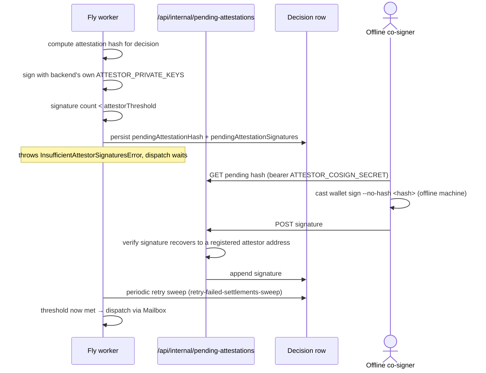

# EVM attestor custody + governance — DONE, and how to keep operating it

## Co-signing flow

What happens when the backend's own attestor key isn't enough to reach
threshold alone:



This used to be a plan for setting up real M-of-N attestor key custody.
As of this pass, both the EVM and Solana sides are done, wired into the
real dispatch path, and verified live — not just designed. This doc
records what's real, and how to operate it day-to-day.

## Current live state

- **DecisionRelay**: `0xC7e496870cdd4A694fffBFa466056aE427E71Dee` (Sepolia)
- **Attestors**: 2-of-2 —
  - `0x3261CEF8Ca14FCc9EF1Cd584209D7c3b7f578b70`, backend-held (`ATTESTOR_PRIVATE_KEYS` on `anc-hor-worker`)
  - `0x229d46B4C22B5AA42fE7cDAae37cf611e726f732`, held **offline**, generated on a machine never connected to Fly/Vercel — the backend never had this private key
- **Governance owner**: Gnosis Safe `0xc200534F7DEbF2816C085C5A156aBd686fA19f4C`, 2-of-2, owned by the deployer wallet + a separate governance key also held offline (`0xEDc300fb7Bd8437C90aF68393381514722FE128c`) — distinct from the attestor key above, on purpose (see "Why governance is a separate key" below)

Real 2-of-2 settlement was proven end-to-end: `dispatchDecisionForCase`
genuinely throws `InsufficientAttestorSignaturesError` when only the
backend's 1 key is available, and only completes once the offline
attestor's real signature is added — verified via a live dispatch
(`0x804ed5882a1ec114274e23fd7f5b64dadb3996be637056dfdf596da24693f580`)
that settled only after both signatures were present.

## Why "the backend holds threshold-many keys" isn't real security

If `attestorThreshold = 2` and the backend process holds both keys,
compromising that one process is enough to forge a settlement — a
single point of failure, just spread across more key files. That's
exactly the gap this closes: the backend now holds strictly fewer than
`attestorThreshold` keys (1 of 2), so it structurally cannot dispatch
alone anymore.

## Why governance is a separate key from the attestor key

`DecisionRelay.sol`'s `owner` can `addAttestor`/`removeAttestor` and
`setAttestorThreshold` — i.e., rewrite the very policy the attestors
enforce. An owner that's the same key as an attestor (or the backend)
could lower the threshold to 1 and settle unilaterally, defeating the
M-of-N guarantee entirely without ever forging a signature. That's why
`owner` is now a separate 2-of-2 Safe, not a wallet, and why the
governance key is distinct from the attestor key even though the same
person holds both offline — a compromise of one doesn't hand over the
other's authority.

## Day-to-day: co-signing a real decision

When a real decision can't settle because the backend's key alone
doesn't reach threshold, `Decision.pendingAttestationHash` gets set and
`relayError` shows `"awaiting external attestor signature(s): 1/2
collected"`.

1. **Find pending decisions:**
   ```bash
   curl -H "Authorization: Bearer $ATTESTOR_COSIGN_SECRET" \
     https://anc-hor.vercel.app/api/internal/pending-attestations
   ```
2. **Sign the hash offline**, using the attestor private key (never
   paste this key anywhere online):
   ```bash
   cast wallet sign --private-key <attestor_key> --no-hash <attestationHash>
   ```
3. **Submit only the signature:**
   ```bash
   curl -X POST -H "Authorization: Bearer $ATTESTOR_COSIGN_SECRET" \
     -H "Content-Type: application/json" \
     -d '{"signature":"0x..."}' \
     https://anc-hor.vercel.app/api/internal/pending-attestations/<decisionId>/sign
   ```
   The route verifies the signature actually recovers to a registered
   attestor address before accepting it (`isRegisteredAttestor` on-chain
   read) — a bad or unregistered signature is rejected outright, not
   silently stored.
4. Settlement completes within ~10 minutes via `anc-hor-worker`'s
   `retryFailedSettlements` sweep (that process is the only one holding
   `HYPERLANE_RELAY_PRIVATE_KEY`/`ATTESTOR_PRIVATE_KEYS`; the Vercel-side
   API route deliberately doesn't attempt dispatch itself).

`ATTESTOR_COSIGN_SECRET` gates *who can attempt to submit* a signature,
not whether it's valid — treat it like any other backend secret
(rotatable, not attestor-key-equivalent), since a submitted signature
that doesn't recover to a registered attestor is rejected regardless of
who submitted it.

## Day-to-day: a governance change (adding/removing an attestor, changing threshold)

Any `addAttestor`/`removeAttestor`/`setAttestorThreshold`/
`setTrustedSender`/`setSettlementTarget` call now needs 2 Safe
signatures, not 1 EOA transaction:

1. Compute the call's inner calldata (e.g.
   `cast calldata "addAttestor(address)" <addr>`).
2. Read the Safe's current `nonce()` and call `getTransactionHash(...)`
   on the Safe (`0xc200534F7DEbF2816C085C5A156aBd686fA19f4C`) with that
   calldata, `operation=0`, all gas/refund params zeroed, to get the
   hash to sign.
3. Both owners run `cast wallet sign --private-key <key> --no-hash
   <hash>` independently.
4. Concatenate the two signatures **sorted by signer address
   ascending** and call `execTransaction(...)` on the Safe with them —
   see this session's transcript for the exact `cast send` invocation
   used for the two governance changes made during setup, as a working
   template.

Every one of these emits a distinct event now (`AttestorAdded`,
`AttestorRemoved`, `AttestorThresholdChanged`, `TrustedSenderChanged`,
`SettlementTargetChanged` — see `DecisionRelay.sol`) — worth watching
via a block explorer alert or a small script if this becomes routine,
since a re-audit specifically flagged that a compromised owner
rewriting the policy should be loud, not silent.

## Never do

- Never let the backend hold `attestorThreshold`-or-more attestor keys
  at once — that silently undoes all of the above.
- Never let a Safe owner key double as an attestor key, or vice versa.
- Never treat a key whose private material has appeared anywhere
  online (a chat log, a committed file, a screen-shared terminal) as
  real custody again — remove it as an attestor/owner and generate a
  fresh one, the way the interim "spare" attestor key was removed once
  its key had appeared in this conversation's transcript.

## Solana side (decision-relay) — DONE, real 2-of-2

`decision-relay`'s `ATTESTOR_PUBKEY` (single key) is now
`ATTESTOR_PUBKEYS: [Pubkey; 2]` + `ATTESTOR_THRESHOLD: usize = 2` —
`attested_settle` now requires that many separate, distinct-signer
Ed25519-verify instructions immediately preceding it (see
`verify_decision_attestations`/`count_distinct_registered_signers` in
`chains/solana/programs/decision-relay/src/lib.rs`), with the exact
same cross-instruction-redirection defense as the original single-key
version (`*_instruction_index` fields required `== u16::MAX`). No
on-chain governance account for this set (unlike the EVM Safe) — it's
consts, rotated by redeploying via this program's own upgrade
authority.

**Live state (2026-09-07: retired the offline key — see below):**
- Program: `DGWSTw1PLsRbndb8spVkrtu3hfH599tRRBJ1JhVBbpVN` (Solana Testnet)
- Attestors: 2-of-3 — `4EnM9nxVcWoaRRsEZnq2otdVrQLiwdBsBkqxdmRoVBCq`
  (backend-held, `SOLANA_ATTESTOR_PRIVATE_KEY` on `anc-hor-worker`),
  `4eCqu5xB2EoLFw5AfSyjTm3cRnjdocs6wfwGaSp7rigZ` (automated, `anc-hor-attestor2`,
  same Fly app already automating the EVM side), `9uKHpvMk9tijzwXFicojZ5z4RnNdcLfqaDxDfjNGGMn1`
  (automated, `anc-hor-attestor3`) — no signature in this set requires a
  human to run anything manually.
- 9 Rust unit tests cover the parsing/dedup/threshold logic
  (`cargo test -p decision-relay`)

**2026-09-07 — retired the pure-offline attestor key
(`7RcEJvhzeHzaZ3CDn5SEe9BEcYLxP1C2KawuCMqof1zY`, previously the second
half of the 2-of-2 set).** It made every Solana settlement wait on a
human manually running the offline-signing command below — discovered
live during a Studio Next migration E2E test, where a real settlement
sat blocked for hours on exactly this. Mirrors the same-day fix to
DecisionRelay.sol's EVM attestor set (2-of-2, one manual key -> 2-of-3,
fully automated). The offline-signing command below is kept for
reference/rollback, not because it's still the normal path.

**Real transaction-size constraint found and fixed during
verification**: each Ed25519 native-program instruction embeds the
full attestation message inline (Solana's architecture gives no way
around this), so 2+ of them plus `AttestedSettle` reliably exceeds the
1232-byte legacy-transaction limit for any realistic `case_id`. Fixed
with a real Address Lookup Table,
`DRSsBj3qsZ3YG2EmAivLPp4vjtJu54FmeZRaWqobeFEs`, pre-loaded with the
static accounts (`Sysvar1nstructions`, the Ed25519 native program, the
escrow program, decision-relay's own program id, and its two PDAs) —
`solana-settle.ts` builds a v0 (versioned) transaction against it, and
auto-extends the same table with a decision's specific
claimant/respondent the first time each address is seen (one small
extra transaction + ~1 slot of latency, never repeated for that
address again). `SOLANA_DECISION_RELAY_LOOKUP_TABLE` in
`apps/web/.env.example` documents this.

**Live-verified end-to-end**, using a realistic-length case ID (25
chars, matching real production case IDs like `CASE-RELAY-...`): a
transaction with only the backend's 1 signature failed inside
`decision-relay` itself at the attestation gate (`invalid program
argument`, before ever reaching the escrow CPI). A transaction with
both the backend's and the offline attestor's real signatures — the
offline signature produced via Node's built-in `crypto.sign` (Ed25519,
PKCS8-wrapped raw seed, no npm install needed) from the offline
machine, verified independently against the message before submission
— passed the attestation gate entirely and reached the real escrow
program's `Settle` instruction, failing only with `AccountNotInitialized`
because the test case_id was never actually disputed in escrow. That
failure point (inside the *escrow* program, not decision-relay) is
itself the proof: the M-of-N gate let it through only once both
signatures were present.

### Co-signing a real decision (Solana side) — DONE, real API now

A re-audit correctly found that the automated dispatch path
(`hyperlane.ts`'s Sealevel branch) never actually supplied
`externalAttestations` to `submitAttestedSettle`, so a real 2-of-2
Solana decision would throw `InsufficientSolanaAttestationsError`
every time with no path to recovery — the workflow described below
now exists for real, mirroring the EVM one:

1. **Find pending decisions:**
   ```bash
   curl -H "Authorization: Bearer $ATTESTOR_COSIGN_SECRET" \
     https://anc-hor.vercel.app/api/internal/pending-solana-attestations
   ```
2. **Sign the message offline**, using the attestor private key (never
   paste this key anywhere online). Node's built-in `crypto.sign` works
   with no extra packages — wrap the raw 32-byte seed in the fixed
   16-byte Ed25519 PKCS8 DER prefix `302e020100300506032b657004220420`
   first:
   ```bash
   node -e 'const c=require("crypto");const seed=Buffer.from(JSON.parse(require("fs").readFileSync("keypair.json","utf8"))).subarray(0,32);const priv=c.createPrivateKey({key:Buffer.concat([Buffer.from("302e020100300506032b657004220420","hex"),seed]),format:"der",type:"pkcs8"});console.log("0x"+c.sign(null,Buffer.from(process.argv[1].slice(2),"hex"),priv).toString("hex"))' <messageHex>
   ```
3. **Submit the public key + signature** (never the private key):
   ```bash
   curl -X POST -H "Authorization: Bearer $ATTESTOR_COSIGN_SECRET" \
     -H "Content-Type: application/json" \
     -d '{"publicKey":"<base58 pubkey>","signature":"0x..."}' \
     https://anc-hor.vercel.app/api/internal/pending-solana-attestations/<decisionId>/sign
   ```
   The route verifies the signature actually matches the claimed public
   key (Node's built-in `crypto.verify`, no dependency) and that the
   key is one of `decision-relay`'s registered `ATTESTOR_PUBKEYS`
   before ever storing it — an invalid or unregistered submission is
   rejected outright, not silently recorded.
4. Settlement completes within ~10 minutes via `anc-hor-worker`'s
   `retryFailedSettlements` sweep, same as the EVM side.

Client-side, `solana-settle.ts`'s `validateExternalAttestations`
additionally rejects/dedupes malformed, unknown-key, or duplicate-signer
external attestations *before* any Ed25519 instruction is built — a
re-audit flagged that a caller-supplied array with extra/invalid
entries could otherwise push a genuinely valid signature pair outside
the exact instruction window `decision-relay`'s Rust program scans.
Covered end-to-end (real Ed25519 crypto, real Postgres, no mocked
cryptography) by `apps/web/tests/integration/solana-cosign.test.ts`.
