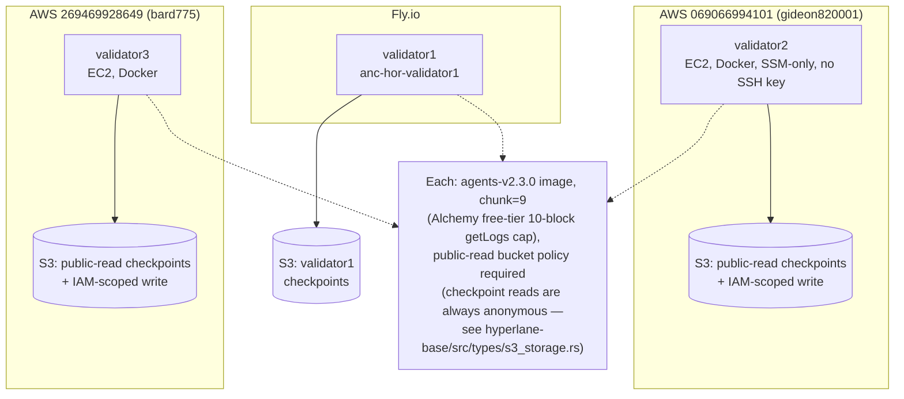

# Replacing the permissive ISM with a real Hyperlane validator set — DONE (mostly), how to keep operating it

> **Update (2026-09-06)**: the "two validators, one operator" state
> described below is superseded — there are now 3 validators across 2
> independent AWS accounts plus Fly, per
> [`docs/mainnet-readiness-runbook.md`](mainnet-readiness-runbook.md) §0.
> The prose below is kept as historical context for how the 2-validator
> setup was built; the hosting topology diagram right below is current.



This used to be a plan. As of this pass, it's mostly real and live: two
validators are running, announced on-chain, and a real 2-of-2 multisig
ISM is wired to `DecisionRelay`. What's still a placeholder (both
validators run under one operator's Fly account) is called out below.

## Live state

- **Validators**: `anc-hor-validator1` and `anc-hor-validator2` (Fly
  apps, `ord` region), running the official `hyperlane-agent` image's
  `./validator` binary against Sepolia.
  - `0x2ffFd80d446835214EF87Eb3753B48935550f73f` (validator1)
  - `0x0eD86FBF8cb56622BB3094FeCde2872018e0f4B3` (validator2)
  - Both confirmed announced on-chain via `ValidatorAnnounce.getAnnouncedStorageLocations`
- **Checkpoint storage**: real AWS S3 (bucket `anchor-hyperlane-validator-checkpoints`,
  `eu-north-1`) — **not** Cloudflare R2. See "Why AWS S3, not R2" below.
- **Multisig ISM**: a real `StaticMerkleRootMultisigIsm`, deployed via
  Hyperlane's own canonical factory
  (`staticMerkleRootMultisigIsmFactory` = `0x0a71AcC99967829eE305a285750017C4916Ca269`,
  confirmed from `hyperlane-registry`, not guessed), at
  `0xf9Ceb195C295c496952649574A78B2Da6dD7b05f`, requiring 2-of-2
  checkpoints from the validators above.
- **DecisionRelay**: redeployed again at
  `0x94f3FF552CC879a36B19b829af3325Ea72cbC71C`, `customIsm` pointed at
  the real multisig ISM instead of `TrustedRelayerIsm`. `trustedSender`
  reconfigured via the same 2-of-2 Safe governance flow as
  `docs/multisig-attestor-setup.md`.
- The self-hosted relayer's whitelist
  (`chains/hyperlane-relayer/entrypoint.sh`) updated to this address.

## Why AWS S3, not Cloudflare R2

R2 was tried first (free, no egress fees, the more obviously "free
self-hosted" option). It turned out the official Hyperlane validator
binary (`agents-v2.3.0`, and the `main` build — both tried) has a real
upstream bug in how its bundled AWS SDK handles a custom S3-compatible
endpoint: with `--checkpointSyncer.region auto` (R2's own convention),
it silently ignores `--checkpointSyncer.endpoint` and constructs a
nonexistent AWS hostname (`<bucket>.s3.auto.amazonaws.com`) instead —
a hard DNS failure. Switching to a real-looking region string
(`us-east-1`) fixes the hostname construction but then the SDK's
request signing rejects R2 with `InvalidAccessKeyId`/`NoSuchBucket` —
confirmed NOT a credentials problem, since a real `@aws-sdk/client-s3`
client with the exact same credentials/bucket/endpoint connects fine.
This is a genuine compatibility gap between this specific agent build
and R2, not anything in this repo's control. Real AWS S3 (which is
what Hyperlane's own agent is actually built/tested against) works
immediately with no special flags. AWS S3's free tier (12 months,
5GB, generous request limits) keeps this free the same way R2 would
have.

## What's still a placeholder

Both validators run under the same Fly.io account/operator. That's
**not** real operator independence — the whole point of a validator
*set* is that no single compromise takes out enough of them. Real
independence needs a second (and ideally third) genuinely separate
operator: a different person, different Fly account (or different
provider entirely), different key generated on their own machine. The
mechanism (validator binary, S3 checkpoint storage, ValidatorAnnounce,
a multisig ISM) is proven and working — adding a real second/third
operator later is "run steps 1-3 below again on someone else's
infrastructure and add them via a new ISM deployment," not a redesign.

## Day-2: adding another validator

1. **Generate a key** — on the new operator's own machine:
   ```bash
   cast wallet new
   ```
2. **Deploy a validator app** — copy `chains/hyperlane-validator/`'s
   `Dockerfile`/`entrypoint.sh`/`config.json` as a template. Fly secrets
   needed: `VALIDATOR_KEY`, `AWS_ACCESS_KEY_ID`, `AWS_SECRET_ACCESS_KEY`
   (their own S3 bucket/IAM user, or a folder in the shared one if you
   trust them with write access to it), `S3_BUCKET`, `S3_REGION`,
   `S3_FOLDER`.
3. **Deploy and start it** — same two-step dance this session needed
   (`flyctl deploy`, then `flyctl machine start <id>` since these apps
   have no `[http_service]` and don't auto-start after a config-only
   deploy).
4. **Verify it announced**:
   ```bash
   cast call 0xE6105C59480a1B7DD3E4f28153aFdbE12F4CfCD9 \
     "getAnnouncedStorageLocations(address[])(string[][])" "[<new_validator_address>]" \
     --rpc-url $SEPOLIA_RPC_URL
   ```
5. **Deploy a new multisig ISM** including the new validator (via the
   same factory, `getAddress`/`deploy(address[],uint8)` — see this
   session's transcript for the exact `cast` invocations used as a
   working template) with your chosen new threshold (e.g. 2-of-3).
6. **Point DecisionRelay at it** — `CUSTOM_ISM=<new ISM address>` when
   re-running `chains/evm/deploy/DeployDecisionRelay.s.sol`, then the
   same Safe governance dance to set `trustedSender` on the fresh
   contract, then update the relayer's `WHITELIST` to the new address
   and redeploy it.

## What stays true either way

`DecisionRelay.sol`'s attestation requirement
(`docs/multisig-attestor-setup.md`) remains valuable and should NOT be
removed even with a real multisig ISM in place — it verifies the
decision *content* is genuine, which a message-origin ISM alone
doesn't do (a compromised dispatch pipeline could still relay a real,
correctly-signed-by-validators message carrying a fabricated
decision, absent the attestor check). The two defenses are
complementary: ISM = "this message really came from the claimed
origin chain," attestation = "this decision's content is really what
Anchor decided."

## Solana side — still permissive

This work only closed the Sepolia inbound ISM gap. `decision-relay`'s
Solana-side `TRUSTED_ISM` (a composite ISM's `TrustedRelayer` node,
see `chains/solana/programs/decision-relay/src/lib.rs`) is still
always-true for the same reasoning `TrustedRelayerIsm.sol` was — a
real Sealevel multisig ISM is a separate, not-yet-attempted piece of
work. Since `decision-relay`'s `attested_settle` no longer trusts
Hyperlane delivery alone for moving funds (see
`docs/multisig-attestor-setup.md`'s Solana section — real M-of-N
attestation gates that path independently), the practical exposure
here is narrower than the EVM side was before this fix, but it's not
nothing: a forged/spam inbound message can still reach `handle()`
(notification-only, logs but doesn't move funds) without real
transport-origin verification.
