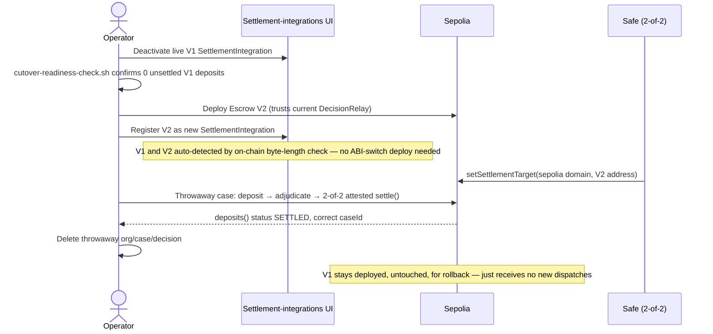

# V1 → V2 Escrow cutover plan (Item D)

## Status: DONE (2026-09-04) — real cutover executed and verified

The real production cutover described below was actually carried out, in order, exactly as planned:

1. **Freeze**: the live V1 `SettlementIntegration` (`cmtlfw1f6000111gz42rvc3vo`, org: Admin, escrow `0x5314725C32b58d0e1CACa510d491c8492D0BE997`) was deactivated via the real `/settings/settlement-integrations` UI.
2. **Drain / Confirm**: `scripts/cutover-readiness-check.sh` confirmed 0 unsettled V1 deposits (of 2 ever made, both `SETTLED`) immediately before proceeding.
3. **Deploy V2**: a real production `Escrow` V2 was deployed to Sepolia — `0x76f0eaABbe379A0fBd56516D76C0201272ab5Ad5`, trusting the real `DecisionRelay` (`0x94f3FF552CC879a36B19b829af3325Ea72cbC71C`) as its sole `settle()`/`emergencyRefund()` caller. Registered as a new `SettlementIntegration` (`cmtn0uimm0002ycn6dpiiaq2r`) via the real app UI — auto-detected as V2 by the real on-chain byte-length check (`lib/escrow-version.ts`). **No separate ABI-switch deploy was needed** — Priority 2's dynamic per-integration version detection (built earlier this session) already handles V1 and V2 simultaneously, which simplifies this step relative to the original plan below.
4. **Repoint governance**: the real 2-of-2 Safe (`0xc200534F7DEbF2816C085C5A156aBd686fA19f4C`) executed `setSettlementTarget(11155111, 0x76f0eaABbe379A0fBd56516D76C0201272ab5Ad5)` — tx `0x8fb03a9716730e48edd798326fffc2a1f83ef155252e780bc51be9c256f1e965`, real `SettlementTargetChanged` event confirmed on-chain (old: V1, new: V2).
5. **Re-verify**: a dedicated throwaway synthetic case was bound to the new production V2 integration, deposited into for real (tx `0x1cc132180c6219eb5d7950638f11547eefecccfa846df319d932b745105fbd49`), confirmed via the real Item C flow, and dispatched through the real `DecisionRelay` with a real 2-of-2 attestor signature (backend + offline co-signer) — real `settle()` execution, tx `0x9f62adcba27187e24cdd44dbdccf61fbf7dae4e0f913a21b8ec76aec07583d79`. `deposits()` status confirmed `SETTLED (2)` with the correct `caseId` intact. `SETTLEMENT_PAUSED` was briefly, explicitly lifted for that one dispatch and immediately re-armed (confirmed `true` afterward). The throwaway org/case/decision were deleted immediately after.

`DecisionRelay.settlementTarget(11155111)` now reads `0x76f0eaABbe379A0fBd56516D76C0201272ab5Ad5` in production. V1 remains deployed and functional (untouched, per the rollback section below) but no longer receives new dispatches.

The rest of this document (below) is the original plan, kept for reference — it describes exactly what was executed above.

## Why this exists

`Escrow` V2 source (`chains/evm/contracts/Escrow.sol`, already committed — adds `caseId` to the `Deposit` struct and enforces it in `settle()`) has existed since earlier this session but has never been deployed. The re-audit's own instruction was explicit: **do not deploy it or repoint `DecisionRelay.settlementTarget` without a real migration plan first.** This is that plan.

## The structural constraint that shapes every option below

`DecisionRelay.settlementTarget(uint32 domain)` is a single global mapping, keyed only by Hyperlane domain (e.g. `11155111` for Sepolia) — **not** by case, integration, or escrow contract. There is exactly one live settlement target per domain at any moment. Repointing it to V2 redirects *every* case's dispatch on that domain simultaneously, including any case whose deposit still sits, unsettled, in V1.

This is the one fact that rules out "just deploy V2 and flip the target" as a safe default: if any V1 deposit is `DEPOSITED` (not yet `SETTLED`) at the moment of the flip, `DecisionRelay` calling into V2 for its dispatch means `settle()` is never reachable for that V1 deposit again through the normal path — it would need the same kind of manual recovery this project's own settlement-availability incident required (see `incidents/2026-09-03-settlement-availability.md`), and unlike that incident, there would be no way to construct a valid recovery dispatch, because `settle()` would be calling the *wrong contract entirely*, not just a wrong-but-callable target.

## Two options considered

### Option A — drain before cutover (recommended)

Settle or refund every V1 deposit first, confirm zero remain (via `scripts/cutover-readiness-check.sh`), *then* deploy V2 and repoint `settlementTarget`. Simple, no new contract complexity, matches how this project already operates (one active integration at a time — see `SettlementIntegration.active`).

**Cost**: cases can't be *newly bound* to a settlement integration during the drain window without deliberately choosing which version they'll settle against (see the freeze step below) — a short, planned pause in new escrow bindings, not in adjudication itself.

### Option B — a versioned settlement router

Insert a small router contract as `DecisionRelay`'s single `settlementTarget`, which itself dispatches to either V1 or V2 based on which escrow a given `escrowId`/`caseId` was actually deposited into. Lets V1 and V2 deposits coexist indefinitely.

**Cost**: a new contract, a new trust boundary, and — per this session's own hard-won lesson from the original incident — another piece of "is this wired correctly" state that can silently be misconfigured. Given this project has had **exactly one V1 deposit, ever** (per the Phase 0 inventory), building permanent dual-version routing to solve a coexistence problem that doesn't currently exist is speculative infrastructure for a case count of one.

**Decision: Option A.** Revisit Option B only if V1 deposit volume becomes large enough that a full drain before every future contract upgrade becomes impractical — not a decision to make in advance of that being true.

## The cutover procedure

Every step here is designed to be forced into the right order by the tooling, not just by discipline:

1. **Freeze new bindings.** Set every `active: true` `SettlementIntegration` pointing at the V1 escrow to `active: false` via `PATCH /api/settlement-integrations/:id` (see Item C). `POST /api/cases/:id/settlement` already refuses to bind to an inactive integration — this is an existing, enforced check, not a new one.
2. **Drain.** For every `CaseSettlement` still `DEPOSITED` against V1: let it settle normally (adjudication runs its course, `dispatchSettlementForDecision` fires as usual — nothing about the drain changes normal case handling), or, for a case that will never adjudicate, refund it (see Item E — a governed refund path is a prerequisite for this step being reliably completable, not optional).
3. **Confirm.** Run `scripts/cutover-readiness-check.sh` and require its exit code `0` (`READY`). It scans **every** `Deposited` event V1 has ever emitted (not just what `CaseSettlement` rows the DB happens to have — the DB record for this project's one real deposit was itself found stale once already this session) and independently re-derives each one's live status. Re-run it immediately before step 5 — state can change between confirmation and execution.
4. **Deploy V2 and update the app's ABI in the same release.** `lib/escrow.ts` and `lib/case-settlement.ts` currently call V1's `deposits()` ABI (4 return fields: `status, claimant, respondent, amount`). V2 adds a 5th (`caseId`) and `settle()` gains a `caseId` check. If the app's ABI changes before `settlementTarget` is repointed, every read against the still-live V1 contract mis-decodes (see the real bug this exact plan's own readiness script hit while being built — a 5-output ABI call against V1's 4-output `deposits()` returned an undecodable error, not a wrong-but-plausible value). If `settlementTarget` is repointed before the ABI changes, the same mis-decode happens against V2 instead. **These two changes ship as one deploy, one commit, one release — never separately.**
5. **Repoint governance.** The 2-of-2 Safe calls `DecisionRelay.setSettlementTarget(11155111, <V2 address>)` — same real governance procedure already used once this session (`docs/multisig-attestor-setup.md`), with `cast wallet verify` checked against both signatures before submission, same as before. `SETTLEMENT_PAUSED` stays exactly as it currently is throughout — this plan does not change that gate's own discipline (lift only for an explicitly authorized single action, re-arm immediately).
6. **Re-verify.** `cast call <DecisionRelay> "settlementTarget(uint32)(address)" 11155111` reads back V2. Bind one real (or rehearsal — see below) case to a fresh V2 `SettlementIntegration` and confirm the full path end to end before considering the cutover complete.

## Rehearsal — DONE (2026-09-04), real, end-to-end, passed

A "no customer funds" rehearsal, exactly as originally scoped below, was actually run and succeeded. Real addresses (Sepolia, both now abandoned/unused — no funds beyond the one rehearsal deposit ever touched them, nothing points to them anymore):

- Rehearsal `DecisionRelay`: `0xf19027e7EA05165A44336F5A2c53f7A09B26a0F3` (own governance owner = the operator's own deploy wallet, not the real Safe; reused the real 2-of-2 attestor set and the real production multisig ISM, since both only verify signatures/checkpoints and carry no fund custody of their own).
- Rehearsal `Escrow` V2: `0x5b15a8b6c7BD8C3fB104332A61dA2a5912290794`, `decisionRelay` pointed at the rehearsal relay above — never the production one.

What was actually proven, step by step, all real transactions on Sepolia:

1. **Deposit**: 0.0001 ETH deposited into the rehearsal Escrow for a synthetic case created solely for this rehearsal (never a real org's case) — tx `0xffc454599d60e68888966dfb690d393b06daf10e4d5bfc1e86c9160f2a0f7a04`. On-chain `deposits()` read back confirmed the V2-only `caseId` field stored correctly.
2. **App-level confirm-deposit**: the real Item C `checkAndConfirmDeposit` flow, on-chain-authoritative, exactly as production uses it.
3. **Real 2-of-2 attestation**: a real Decision row, real backend attestor signature, real offline-attestor co-signature collected via the same `/api/internal/pending-attestations` flow documented in `docs/multisig-attestor-setup.md` — same governance boundary as production, not bypassed.
4. **Real dispatch**: the actual production `dispatchSettlementForDecision` function sent a real Hyperlane message — tx `0x1ead2404c292240fe077058843100f8bb050df5f47cfde7be23ed1d2fd7f26d4`. This required a brief, explicitly authorized lift of `SETTLEMENT_PAUSED` (immediately re-armed right after — confirmed back to `true`).
5. **Real relayer delivery + settle()**: the self-hosted relayer (temporarily whitelisted for the rehearsal `DecisionRelay`'s domain/address, reverted after) delivered the message; `handle()` called `settle()` on the rehearsal Escrow — tx `0xb6c8eea3aca5c264f90aa9fdb1eff7ea9b851f3a0ac663f465cb5984ca97d27d`, `claimantAmount = 0.0001 ETH`, `respondentAmount = 0`, matching the deposit exactly. `deposits()` status flipped `DEPOSITED (1)` → `SETTLED (2)`.

**Result: `settle()`'s new `caseId` enforcement — the actual thing V2 changes — works correctly end to end, through the real app dispatch code path, not a shortcut.**

Cleanup performed immediately after: the rehearsal DB rows (a dedicated throwaway Organization/Case/Decision, never a real org's data) were deleted; the relayer's whitelist entry for the rehearsal `DecisionRelay` was reverted and redeployed. The rehearsal contracts themselves are simply abandoned on Sepolia — no cleanup possible for a deployed contract, but they hold no funds and nothing in this codebase points to them anymore.

This result does not itself authorize the real cutover below — it's evidence the mechanism works, not the separate go/no-go decision the real cutover still requires (see "What this plan deliberately does not cover").

Original rehearsal scope (for reference — superseded by the real run above)

A "no customer funds" rehearsal means: deploy a *second*, throwaway `Escrow` V2 instance to Sepolia, register it as its own `SettlementIntegration`, bind a synthetic case created solely for this purpose (never a real org's case), deposit a trivial test amount, run it through `confirm-deposit` (Item C), and dispatch a real settlement — proving `settle()`'s new `caseId` enforcement actually works end to end — all without touching the live V1 contract, its one settled deposit, or `DecisionRelay`'s real `settlementTarget`.

## Rollback

If step 5 (governance repoint) needs to be reversed before step 6 completes: the Safe can call `setSettlementTarget` again, pointing back at V1 — V1 itself is untouched by any of this and remains fully functional as long as it isn't drained of its ability to `settle()` (it never loses that ability; `onlyDecisionRelay` just means *some* `DecisionRelay` call reaches it, not that V1 is disabled). No contract-level rollback exists once step 5 executes and further V1 deposits are made after the repoint — which is exactly why step 1 (freeze new bindings) and step 3 (confirm zero unsettled) come first.

## What this plan deliberately does not cover

- **Item E** (a governed refund mechanism) is a real prerequisite for step 2 being reliably completable for a case that will never adjudicate — flagged, not built here.
- **Item F** (reconciliation/alerting) would be what actually notices a V1 deposit made *after* the freeze in step 1 — flagged, not built here.
- This plan does not itself authorize deploying V2, running the rehearsal, or repointing governance. Each remains a separate, explicit go/no-go decision, same discipline as every contract-affecting action this session.
